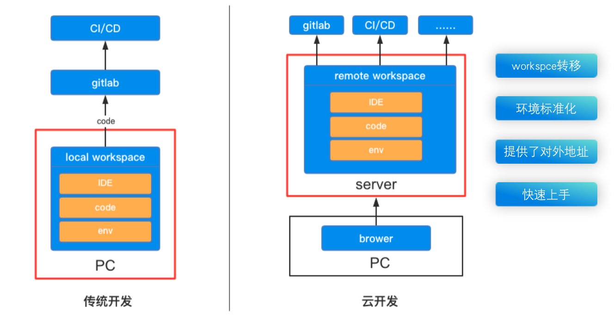
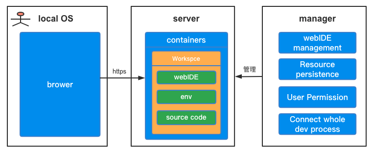
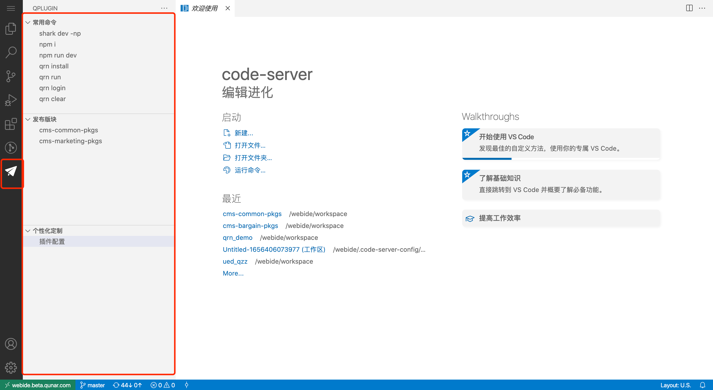

## 1 背景

### 1.1 我们遇到的问题

在云原生的落地过程，serverless是很重要的一个课题，它能让开发同学免去繁琐的服务器搭建和运维工作，轻松的实现功能的迭代和交付。云开发是目前serverless架构的经典实践，因此我们基于此进行了探索。

去哪儿网拥有大量的前端工程，数以百记的前端工程代码，对于前端工程师来说如何在当前疫情严重，人力紧张，不熟悉项目的情况下，随时随地快速着手开发并发布项目；对于团队来说如何保证团队配置化的统一，让开发者按照规范工作；带着这些问题，参考云原生实践，我们实现了去哪儿网云开发平台，面向业务场景提供了标准的容器化的开发环境，对开发者来说大大提升了便捷性。提效方面：对于首次启动项目并开发来说提效80%；对于日常开发维护的项目提效60%。本文会重点阐述云原生背景下云开发带给开发者的优势，以及去哪儿网云开发整体的技术方案以及产品实践。

以下这些场景开发同学应该经常遇到：

- 当我们要对一个新项目修复bug时，很可能代码改写只需要5min，但安装环境花了两小时；
- 作为一个新人，或者说接手一个新项目的时候，按文档教程安装环境，项目依旧跑不起来。这个有可能就是某个依赖的版本安装的不匹配或是文档没有及时更新。
- 前后端联调时，我们前端总是需要发beta版本才能让后端和产品同事看到页面效果。如果有一些需要频繁修改的内容，那么发版就是一个很大的时间成本。
- 当我们休假的时候，为了保障业务的稳定，必须得带着办公的电脑，那如果现在有一种方案可以不需要那么合适的设备即可办公，是不是就解决了24h待机的问题。

以上都是我们在传统开发中常见的问题，云开发就是为了解决这些问题出现的。

### 1.2 传统开发VS云开发

左边这一侧是传统开发的流程，可以看到，它的工作区重心是在本地，需要开发者自己去安装ide，搭建依赖环境，自己去gitlab上拉取代码，然后开发完成后再去到发布平台去发布。

而云开发呢，相对于传统开发，他的工作区重心从本地转移到了server端。开发者无需去关心IDE安装、代码拉取，更重要的是环境依赖安装，这一步呢其实就解决了我们先前提出的环境安装问题。同时，在server端启动服务后，会对外暴露一个服务的地址，这个地址可以在内网环境被所有人访问，这样的话，也就免去了每次都要发beta版本联调的问题。那对于开发者来说，本地只需要一个浏览器即可。我们不需要那么合适的设备即可快速上手开发。

那从以上可以看出，云开发相对于本地开发有着一些独特的优势，那我们来总结归纳一下。

### 1.3 云开发优势

云开发的优势可以分为4个方面：

1. 解决运行环境问题。云开发环境会根据业务场景提前预置需要的依赖，而这另一方面也保证了团队之间的环境一致性，从而避免因为环境导致的一系列问题。

1. 探索云时代团队协作的新模式，怎么做到团队配置化的统一，怎么让开发者按照我们的规范去工作。比如当团队协作开发时，我们每个人本地安装的环境版本是否一样，也是一个非常重要的开发问题，即便你的开发环境有很详细的文档，也很难把所有的细节都写清楚。举一个例子，像前端同学经常用的npm包，发版会很频繁，如果同步只能是群里发公告，然后其他同学再去更新，一来一去增加了非常大的时间沟通成本。那如果用了云开发，就能避免这些问题。

1. 与研发平台的深度整合，闭合整个研发链路。像我们公司团队很多，各个平台层出不穷，开发过程中往往会伴随多个平台的切换，将IDE嵌入浏览器，同时整合各个研发平台，这样的话避免反复切换平台带来的繁琐与不便。

1. 便捷性。像在疫情之下，难免会有远程办公的情况，云开发让我们不必需要合适的设备即可写代码，这对便利性也是极大地提升。我们开发同学随时创建随时上手开发。

所以综合来看，不论对个人还是企业来说，云开发都有着非常大的优势，这些很大程度上可以提升开发效率，助力研发效能。

那基于公司容器化基础设施，再加上业内开源产品的背景下，为了解决本地开发环境等一系列问题，我们去哪儿开启了自己的云开发时代。

## 2 整体方案
那在了解云开发有这么多的优势之后，接下来我们从去哪儿的角度看实践过程中云开发上的一些理念和方案。这个理念总结来说就是并不是纯粹从一个技术和工具的视角去看待，而更多的是从业务需求，业务场景的视角，我们看怎么能够把这个技术给用好。并且以此需要做什么样的技术创新。

### 2.1 系统整体架构

系统整体架构划分为三部分：开发者本地、远程server端以及管理系统。

开发者在本地使用浏览器通过https来访问远程server端，那在server端我们是基于公司k8s集群搭建的，会针对不同业务场景设计相应的镜像，从而实例化容器，这个容器的工作区包含了webIDE、开发环境和代码等等，这一块就是相当于给用户提供了一套标准的开发环境。最后一部分就是管理平台，包含了对webIDE的管理、文件资源的持久化、开发者的权限和其他平台的整合等。

那接下来就分块讲解下我们在做的过程中的一些方案抉择。

### 2.2 webIDE选型
> 实现云开发需要借助一个非常重要的产品-webIDE，webIDE简单概括就是只需要一个浏览器，就能编写代码，调试代码，甚至是发布代码。

虽然webIDE本身还未流行，但是在各大云厂商，各大国内大厂均已有落地产品，谈不上一个比较新的技术，而且实现方案，也基本明确成熟，这里挑几个业内有代表性的产品进行介绍。

[Theia](https://github.com/eclipse-theia/theia)

Eclipse 推出的云端和桌面IDE平台，star数有17.3K，完全开源。Theia是基于VS Code开发的，它的模块化特性非常适合二次开发，比如gitpod，华为云 CloudIDE、阿里系IDE 便是基于 Theia 开发。

[Code-server](https://github.com/coder/code-server)

Code-server是由 Coder 开发的，它的理念是把VSCode搬到了浏览器上。目前star数有56.6K，个人版是开源的。

vscode是基于electron架构，大家都知道electron它的UI最终是运行在chrome浏览器中，这整个和web架构在UI层是天然相通的。其次vscode底层架构源是typescript，那typescript对于前端同学是相对于比较熟悉的，对于我们后面进行一些源码结构改造提供很好的可拓展性和可定制性。最后，vscode有个最大的优点，它为什么能够发展到现在这个程度，其实和他的插件机制是有关系的。vscode本身的功能其实不是很多，其他的功能都是以插件化的方式插入到vscode里面去。

[stackblitz](https://stackblitz.com/)

stackblitz是一款非常方便写demo的IDE。提供了非容器化方案的纯前端node环境，可以说非常有价值。整体来讲，其技术方案的优点在于不消耗远程资源，但是缺点，一个是不开源，一个是毕竟是模拟的node环境，在系统的一些层面可能会有所缺失。

[JetBrains Projector](https://jetbrains.github.io/projector-client/mkdocs/latest/)

JetBrains Projector是JetBrains提出的“远程开发”解决方案，基于Client + Server架构。star数有1k，也是开源的，但最近JetBrains Projector作为自己的独立产品的开发已暂停，但 Projector 仍然是JetBrains Gateway的重要组成部分，因此官方建议从Projector 切换到 Gateway。

**整体总结**

不管是从star数，还是开源，拓展性角度来说，code-server优点是我们初期阶段选择它作为webIDE的原因。当然其实对于webIDE这一层，是完全可拓展的和可更换的，这个下面讲镜像架构的时候会提及。

### 2.3 本地容器VSk8s集群
> 确定好了webIDE，接下来就需要考虑webIDE部署在哪，是通过容器的方式部署在用户本地呢还是部署在公司统一管理的k8s集群上呢？

那我们就来对比下这两种方案的优缺点：

- 本地容器：docker启动在开发者本地，对于开发者来讲使用的自由度高，但随之而来的是不利于统一管理。对于电脑的配置也要求比较高，而且docker对于我们前端同学来讲也是一个比较大的学习成本。
- k8s集群：它的优点在于便于团队之间的协作开发，且利于公司统一管理，而且不需要依赖于特定的设备，最主要的是我们开发同学不需要额外学习关于容器化的知识，上手比较快。

所以最终我们选择K8s集群管理模式。

### 2.4 镜像架构设计
> 确定好了容器部署，接下来需要设计镜像，因为容器是基于镜像创建的，是由镜像实例化而来的。

在设计镜像时，我们是从业务场景出发来梳理的。

起初，我们是先为cms低代码场景定制的，原因是它短频快的开发模式和云开发即开即用的特性很契合，cms业务覆盖面大，像机酒火车票市场等等都在使用，而且入手难度低，再加上考虑到其他场景的拓展性，比如说qrn、node、h5这些，通过分析这些场景使用的依赖的异同点，我们设计出了下面的镜像架构图。

容器镜像按照分层设计分为了4层：
- 第一层：业务场景层。目前已经提供cms qrn node&qzz等多个场景。这些基本满足了我们公司常用的一些前端场景。那如果后续有想使用云开发的其他业务场景，也可以继续拓展。 
- 第二层：webIDE层。嵌入了我们常用的IDE。像前面提到的vscode浏览器端的code-server，还有jetbrains系列，这一层后期可以根据开发同学的习惯使用进行拓展。
- 第三层：语言环境层。目前支持node.js，后续如果想支持后端，也可以扩展java等等的语言支持能力。
- 第四层：是操作系统层。有centos和ubuntu。

分层的好处在于共享资源，比如说有很多的镜像，可以从base镜像构建而来。所以最终的镜像其实是由这四层基础镜像交叉组合成的一个镜像，便于多语言环境、多IDE类型、多业务场景以及多操作系统的扩展。

**总结**

那有了以上的方案以及实现，我们就可以进行代码编写、运行、debug、push等等一系列常规操作。

## 3 核心难点及解决方案

在使用云开发的过程中，我们也遇到了一些问题。比如说：
1. 创建的云环境太多，导致机器资源利用率并不高。对于公司成本节约就造成了一定的压力。
1. 没有打通开发的全流程。虽然说现在可以写代码了，但是没和其他平台做一个整合，开发流程还是很分散。
1. 我们想安装自己的插件和配置，在当前云环境内是可更改的，但一旦创建一个新的云环境是不生效的。那这种情况与本地开发相比，在开发体验上还不能完全本地化和可定制化。

于是针对于这些问题，我们也做了几个方面的工作去解决。

### 3.1 提高资源利用率-弹性伸缩
第一个问题，为了避免容器资源的浪费，我们启用一个定期清理长期不使用webIDE的机制。

- **方案一：超时回收**

达到不在线的超时时间，比如4小时，即会释放cpu、内存资源，但IDE的配置和已拉取的项目仍持久保存，下次可直接使用。

- **方案二：彻底销毁**

彻底销毁会将持久化的代码资源和配置都删除。

当webIDE容器达到不在线的过期销毁时间，现在设置的是7天，会先给用户发IM消息提示，
提示中已给出IDE的各项信息，如确认不需要使用忽略消息即可，如仍需使用，按照提示操作即可保留IDE。

### 3.2 打通开发全流程
第二个方面，是打通开发的全流程。我们希望除了能实现在浏览器的开发，更希望通过浏览器和公司内其他产品流程结合起来，打通开发的全流程，真正建立研发效能的闭环。

对于开发同学来说，下面这张图就是项目开发的完整链路。

从pmo创建 -> 项目创建 -> 项目开发 -> 代码提交 -> 代码发布 -> pmo关闭。

其中项目打开 -> 项目开发 -> 代码提交这三个阶段可以交由webIDE中操作。其他流程，这里举两个例子：
- 关联pmo：可以在创建云开发环境关联绑定pmo号，而在关闭pmo的时候销毁这个环境。
- 代码发布：也可以打通CI、CD。这块已经实现打通了发布平台，我们来看下。

### 3.3 打通开发全流程-易扩展
对于团队需要的WebIDE，满足日常的开发是必须的。所以易扩展，一定是排在第一位的。所以基于此，我们在插件中，实现了打通全流程中的一环—打通CI/CD。

下面这张图是我们给云环境定制化的一款插件。

插件整体分为三个版块。

**常用命令**

这个就是便利了开发同学，不需要大家打开终端执行命令，而是点击即可自动打开终端执行。除了默认的常用命令，我们还推出了自定义按钮执行脚本的模式，让业务线同学定制化运行程序，参与云开发共建。

**发布版块**

也就是我们打通CI/CD的一环。这部分会根据打开的文件目录自动识别发布类型，不需要开发同学去发布平台查找以及填写发布表单，即可一键关联发布平台。

**个性化定制**

用户可定制安装属于自己的插件，设置后，在新创建的云环境上都是生效的。

**用户个性化配置**

针对于开发体验这块，我们也是尽量保证在浏览器端大家也能有一个本地化的开发体验，那对于vscode来说，插件是必不可少的。

我们把插件分为三种类型：
- 通用插件。比如说中文语言包、深色主题等等
- 面向业务场景的插件。比如说node场景的eslint语法检查插件、react等等的一些开发提示插件
- 支持用户个性化的去定制配置和插件。前两类都是在镜像中内置好的，而这类型插件是在创建云环境的时候去动态设置的，能最大程度的接近本地化。

**小结**

至此，优化完以上问题，webide本身已经非常完美了，但是在开发体验上还是只能近似接近本地化，还是有一些缺失。
比如说在一些快捷键的使用上，因为和chrome本身有一些冲突。如果在快捷键体验上要求比较高的同学，那我们也提供了第二种方式。

### 3.4 localIDE模式
也称为本地ide连接远端容器模式。如下图：

可以看到，与先前我们看到的整体架构图相比，在localOS处由原来的浏览器通过https访问变成了由本地的IDE通过ssh通道连接到server端。

这个过程中，只传输代码、索引等数据，仅将计算匀给服务器，而渲染显示等还是依赖本地的IDE客户端，这种情况下，我们就能完全拥有本地化的开发体验。

## 5. 总结规划
### 5.1 总结

以下是我们一个核心团队反馈的各个阶段使用云开发前后的时间对比及效率提升。

整体而言，对于首次启动并开发的项目来说，云开发效率可以提升80%，对于日常开发、查问题这种业务场景，效率能提升60%

可以看出，在云开发结合打通全流程这一块，对于效率的提升起到了较大的作用。

云开发是我们运用云原生理念和技术在开发提效方向的探索，之前可能我们更多的关注于测试运维阶段，因为这些阶段的复杂度相对来说较高，因此更需要自动化、工具化，然而当基本建设完成之后我们再次盘点完整链路和深入挖掘痛点，开发同学这个庞大的用户群里的效率和质量应该是我们关注的重点。

### 5.2 规划

对于云开发未来的一个规划，主要是分为三个方向。

1. 横向扩展：适配公司内更多的业务场景。
1. 继续优化体验、丰富功能。
    - 比如提升不同场景环境管理功能，让该业务场景的管理员能自己改变镜像中设定的的某些依赖。
    - 创建独立的云开发管理平台。
    - 稳定性运维。
1. 推广工作：云开发模式上线后，一些业务已经在上面开发。不过更多的开发同学还是持有保守态度，后续会继续提升开发体验，让更多同学接受这种新型的开发模式。

