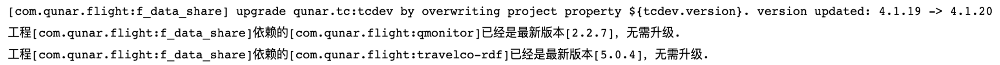

## 中间件自动升级

## 1 背景
作为公共基础服务的提供方，去哪儿网基础架构团队开发并维护了大量的客户端SDK，方便业务接入基础服务。经过多年的发展迭代，目前维护的客户端近30个，线上运行着数百个版本。
客户端SDK在给业务提供使用便利的同时，也给升级推广带来一定的挑战。例如，大规模0day漏洞的安全升级（fastjson/xstream等）, 重点功能落地推广大规模升级（容器化/trace/全链路压测等）。每一次的大规模升级，涉及上千个应用，时间和人力的开销巨大，升级过程常常持续数月，严重影响推进效率。此外，随着迭代增加，众多的版本给维护造成了很多困难。一方面，开发新功能时，许多老的API需要费时费力去兼容。另一方面，对于中间件SDK本身依赖的第三方包（例如netty/guava），不能轻易的升级其版本，否则可能导致业务代码依赖出现兼容性故障。一些业务方为了使用三方包新功能，强行更改第三方包的版本，给兼容性埋下隐患。
基于以上的现状和问题，基础架构团队构思并建立了一套中间件SDK自动升级机制，用较小的成本实现中间件jar包版本的自动升级，为后续的SDK迭代铺平了道路。

## 2 实践框架

### 2.1 重点概述

* 传统规范上，jar包的版本由用户全权控制。一般来说，业务在开发功能时引入相关jar包依赖，选择当下合适版本。测试上线后，版本就固化下来。通常，如果没有碰到bug，没有性能瓶颈和新功能需求，业务方很少会主动升级这些jar包版本。因为升级意味着引入兼容性风险并需要重新回归。因此要让升级自动，首先要解决兼容性问题。
* 升级过程要自动化，打通CI/CD系统，升级过程业务可感知，升级历史可追溯，紧急状态下可回滚、可跳过。
* 业务手动升级jar包时，通常需要做功能回归，以确保质量可靠。自动升级后，风险来到基础部门，相关交付质量保障措施同样需要配套。

目前我们基于这三个难点落地了批量自动化升级方案，整体流程如下：

* 下面从这以上三个难点来分别阐述

### 2.2 升级方案选型
jar包的兼容性问题通常来自于两个方面：
- 中间件SDK本身API的兼容性, 所有对外API接口，必须保证向后兼容。如遇废弃API，必须确认业务代码中实际无依赖才能真正删除。
- 中间件SDK间接依赖的第三方jar包的兼容性。业务与中间件SDK共同依赖的jar包，例如netty/guava/hessian等。这些jar包的各版本API存在或多或少的兼容性问题，一旦中间件或业务方单方面升级三方jar版本，势必会带来冲突。

相对来说，前者兼容性问题较容易把控，因为是我们自己维护的SDK，可以保证新API只增加不删除
而后者的三方包冲突，一直是困扰基础架构团队的痛点。举例来说，中间件依赖的guava，多年来一直是16.0版本，有业务方反馈版本太老希望我们升级到18.0。但是如果贸然升级，由于18.0与16.0部分API不兼容，则一些老用户下次升级中间件就会被影响。因此这些三方包版本几乎无法更新迭代。一些激进的业务方甚至选择冒风险自行升级18.0，不仅流程复杂，隐患也不小。
针对三方依赖冲突的问题，我们开始探索依赖隔离的方案。按照层级划分，有下面三种方案：

- **进程隔离**

进程隔离方案来源于容器化环境sidecar机制，通过将中间件部署到独立sidecar进程中，来实现与业务依赖的完整隔离。这种方式理论上隔离最彻底。但当时公司内还没有推广容器化，缺乏必要的基础环境。此外，进程隔离更适合一些rpc通信框架客户端，但不能覆盖所有客户端，例如序列化/监控等，不太适合独立进程。

- **类加载器隔离**

类加载器隔离方式，来源于蚂蚁开源的ark。通过定制修改运行容器，采用特殊的编译打包结构和类加载模式。通过不同的类加载器来隔离中间件和业务代码依赖的三方包类。该方案实现复杂，依赖较多的定制化设施。另外，实现中需要考虑API接口类的转换翻译（因为分别来自不同类加载器）。同时中间件内部一些相互依赖的隔离需要解决。目前还没有看到大规模落地的案例。
第三种包路径隔离方式是我们最终选择的方案。方案实现非常简单，首先将第三方jar包shade重新打包, 将所有包路径加上qunar特定前缀。由于包路径变了，在jvm层面原包和新包的同一个class加载后就是不同的类。而后修改中间件，将原生的第三方依赖都换成shade之后的三方依赖。从而解决同业务依赖的三方包冲突问题。该方案不需要复杂的周边设施，业务代码无需修改，无感知。也能够最大化的兼容既有客户端。

- **包路径隔离**

我们梳理公司现有的中间件三方包依赖，去掉一些稳定依赖无需处理（版本不再更新，业务和中间件都使用统一版本），剩余大约10多个依赖需要做shade，改动范围不大，同时中间件内部对这些依赖的版本可以做到统一。同时调研发现flink/spring/es等大型开源组件均使用shade的方式来一定程度避免依赖冲突，因此论证方案基本可行。

在shade隔离方案实施过程中，也遇到过一些问题，例如

- **接口签名中含有第三方依赖的类**

我们统计出这些三方类数量只有几个，且都是语义稳定的基础类，例如ListenableFuture。因此，通过开发转换工具方法，实现原生类与shade类相互转换。

- **反射/SPI等调用方式变化**

扫描了shade的三方包，里面没有发现SPI的使用方式。而反射的场景，工具已经做了正确的类包名字符串替换。

- **序列化/反序列化第三方依赖的类**

原因是基础组件SDK接口中暴露的Map直接使用了guava的ImmutableMap，业务方dubbo远程调用时，直接序列化了该三方类，当对方没有shade时，则反序列化出错。我们将对外暴露的map实现换成jdk HashMap即可

shade方案成型后，还做了一些配套措施，规范中间件SDK的开发和使用
* public类标记@TCPublic、@Internal，配合sonar质量门禁规范接口使用。业务代码不能依赖@Internal标记的类（即使它是可见的public类）
* pom内将shade包统一设置为runtime scope，防止业务代码误用。（否则业务开发用IDE补全很容易误引用到shade包）
* 中间件新增接口不再依赖第三方类，全部使用原生类型或自定义类型

### 2.3 升级的自动化设施
-  **升级时机**

我们选择在编译期升级jar包，通过在编译开始前修改pom文件, 能够固化变更历史到代码仓库，能够充分利用编译期检查。对于一次编译多次部署以及代码回滚等场景，能够保证产物一致性。缺点是依赖于业务代码的主动编译发布，我们后续会通过自动发布来解决。
- **升级工具**

为了实现编译期间的pom文件修改，我们开发出一套maven插件。通过编译前执行maven shadow:upgrade命令，对pom文件就地修改。执行结果如下

在CICD流水线中，插件会在测试环境编译前执行。插件通过解析pom，得到现有依赖版本列表。然后查询后台，判定是否满足升级条件，并获取可用的新版本。而后执行pom文件修改，修改完成后将本次改动打上tag存入版本仓库固化下来。后续再用该tag发布线上时，不再执行升级（即使有更新版本）。确保线上版本和本次测试的中间件版本完全一致。尽量让升级风险在测试过程中暴露。
为了统一管理和控制升级行为，我们还开发出一套升级管理后台辅助升级插件。后台可以配置管控各包的版本，做一些前置约束条件检查（例如jdk版本是否满足）。以及特殊情况下添加一些黑名单应用跳过升级。

- **规模化自动升级**

针对升级需要依赖业务代码编译发布的痛点，后台还提供了批量全自动升级功能。允许批量的发起部署任务，周知相关人员，自动检出业务代码master分支版本，并编译升级，而后线上灰度部署，一段时间后全量上线。这样无需业务过多介入就能够完成大批量应用的升级。在最近的几次安全漏洞升级和公司全链路压测推广的升级活动中，该功能大大提升了推广速度，以前需要数月完成的升级计划，现在只要2-3天就能完成，显著提升了推广效率，有效减少了对业务的打扰。尤其是全链路压测的推广，在业务试用过程中，各类问题不断暴露，压测客户端本身也不断迭代，几天就有一个新版本。由于产品的特殊性，需要链路上下游的服务都完成升级，那么每一次升级都是不小的工作量。配合批量升级后台，我们每周都能完成1-2次客户端升级，有效保障了迭代测试效率，这在以往是完全无法实现的。
### 2.4 质量保障机制
在自动升级这一概念推广过程中，业务方最大的疑问在于质量如何保证。由于SDK类问题原因众多，我们尽可能采用自动化手段守住质量底线
* 首先是三方包的兼容性测试，由于部分SDK接口中历史遗留有三方包的类，业务的三方包版本完全自由定义，这部分类的兼容性必须测试通过。
* 其次是接入了业务接口自动化测试平台，覆盖70多个应用。在中间件SDK发版前，借助业务自动化测试平台，测试新版的SDK是否对业务接口有影响
* 此外，还做了测试环境业务应用启动测试。由于中间件SDK特点，很多问题会导致启动失败。借助测试环境自动跑启动测试，也帮助我们发现了不少问题。
  在SDK完成测试后，为了确保未测出隐藏问题影响范围可控，我们在后台管理平台上植入了灰度发版机制。通过应用重要性级别，给应用按照P1、P2、P3分组，不同分组对应升级SDK不同版本。因此，新发布的SDK会先覆盖边缘的应用，数天后再逐渐覆盖全量应用。遇到极端
* 问题时，不至于影响范围太大。

## 3 总结展望
### 3.1 总结

当我们刚开始思考中间件升级方案时，觉得这是一个不可能完成的项目，其中的风险、挑战都是不可想象的，但是当频繁的安全漏洞升级、中间件依赖和业务依赖冲突带来的成本越来越高时，我们就不得不开始思考这个问题，因此我们通过定义问题（中间件升级困难、成本高）、测量（每次升级横跨好几个月、投入100PD+）、分析（自动升级的关键点：方案选型、质量保障、批量自动化升级等）、改进（方案落地）、控制（提前验证、过程质量控制、逐步接入更多组件等）将自动化升级落地了。目前：

- 中间件自动升级机制已覆盖公司绝大部分活跃后端应用。使用SDK版本在3个月以内的应用数占比近80%，版本在1个月以内的应用数占比60%，新版覆盖效率大大提升。
- 已经接入组件除了基础架构的中间件所有SDK，还包括许多部分业务基础组件，例如机票基础数据等
- 配合批量升级机制，目前全公司大规模的升级可以在几天内完成
- 质量方面，目前自动升级系统运行稳定，未出现严重故障。业务方从一开始不敢尝试到现在主动要求帮助他们升级。

### 3.2 展望

未来我们将会搭建公司级的二方/三方包管理平台，包括依赖数据收集、依赖版本分析、依赖版本控制、依赖自动升级，真正的实现中间件的治理闭环。

