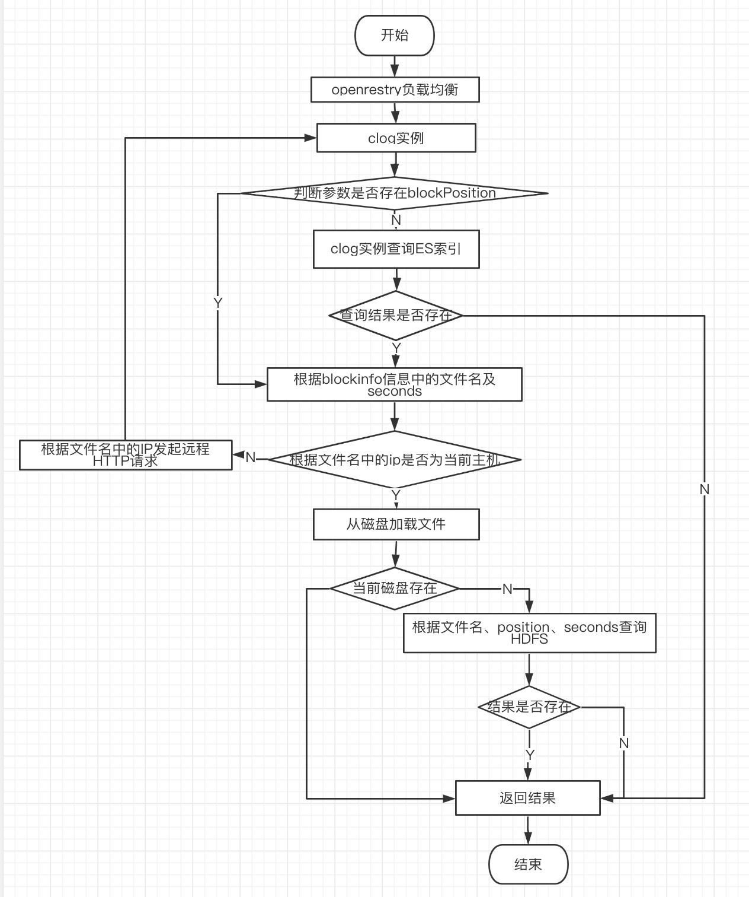

## 异常统计分析服务——Heimdall

## 1.背景

随着业务发展和微服务架构的普及，企业内微服务拆分粒度越来越细，服务间调用关系错综复杂。对于一些复杂的，比如机票和酒店售卖业务场景，可能动辄涉及上百个应用，当某个系统发生异常时会导致多个服务受到影响。此时APM系统就派上了用场，监控（Metrics）、调用链（Tracing）、日志（Logging）帮助业务同学快速定位问题。普通的业务监控报警能起到快速发现问题的作用，但具体case的排查还需要研发人员通过异常栈信息来分析，比如数据库连接异常、空指针等等。

去哪儿网很早就有了监控系统Watcher，能够起到快速提醒业务响应异常的作用，然后开发同学排查是接到报警的系统本身的问题还是下游依赖的系统的问题，如果是下游系统的问题，就要这样一层层地找下去，有时候定位问题时间会比较长。当某个系统出现问题时最根本的表现就是产生异常，如果能直接提示开发同学系统产生了新的异常，或者异常量上涨了，就能够大大缩短开发同学排查问题的时间，做到快速恢复故障。

去哪儿网有一套完整的日志收集和查看体系，首先应用通过日志打印框架将日志打印到本地log文件，机器上默认安装日志收集的agent，将日志内容通过kafka上报，再通过ELK提供日志存储和查询的能力。

如果能够自动地、快速地识别异常，并将日志堆栈内容直接提醒给研发同学，将会大大提高解决问题的效率，甚至防患于未然。因此，异常统计分析系统——Heimdall应运而生，主要目标如下：

- 分钟级别的异常统计
- 发布过程中展示同比环比
- 支持添加监控报警
- 支持用户自定义时间范围查询
- 能够展示异常栈
- 支持应用和机器级别的异常统计

整体的演进包含两个阶段：

- 第一阶段：基于实时日志收集的建设

- 第二阶段：基于基础组件的改造，以在业务服务端直接拦截并上报异常的方式进行了改进

以下分阶段进行阐述。

## 2 实践框架

### 2.1 阶段一：基于实时日志收集的建设

#### 2.1.1 技术栈

实时日志收集kafka+大众点评开源工具CAT+FLINK+Heimdall平台

#### 2.1.2 架构图


#### 2.1.3 核心模块介绍

- **clog模块**
  clog模块主要负责异常栈的接收、存储和查询。消费kafka消息接收日志，解析出ERROR级别的日志，并将其关联的应用、trace、日志详情、时间戳等相关信息一并存储起来，再将转换成统一格式的日志以kafka消息的形式发出，待flink任务消费并做进一步解析。clog的存储结构分为三层：本地磁盘（临时存储）+ES（做文件索引）+HDFS（持久存储）。这样的存储结构保证了热数据的快速查询和冷数据的持久存储。
  
  存储：首先全部的实时日志都会按bu发送到kafka，clog以二进制流的方式消费此kafka消息，然后经过MessagePackDecoder进行解析，解析出日志级别、AppCode、traceId等信息，组装成固定格式的日志内容。再由BlockProcessor为每个DataBlock构造出索引用于查询，EsIndexManager将索引保存到ES中，数据部分DataBlock保存到本地文件，定时转存到HDFS做持久存储。
  block position格式定义： ip-保留天数-时间(yyMMddHHmmss)-offset，例如：10.xx.xx.xx-7-20211110185535-4625901837。
  每个应用5s一个block，一个block最大8M，当本地磁盘空间利用率达到75%，就上传到HDFS。
  
  存储架构图：


  查询：查询异常详情时先查询ES，得到索引，根据索引判断本机是否存在相应的blockPosition，如果是本机ip并且本地磁盘中存在，直接从磁盘读取数据返回，若是本机ip但磁盘中不存在，根据文件名、position、seconds等信息查询HDFS。如果不是本机ip，则向索引中的ip发起远程HTTP请求，转化成对应ip的查询。

查询流程图：




- **flink任务模块**
flink任务主要用来进行异常信息的解析计算处理，将异常类型、应用、机器等相关信息提取出来，按分钟级别做次数统计，并打印异常指标到监控系统。

#### 2.1.4 难点分析

- **实时日志收集的日志量巨大—消耗资源大**

  由于实时收集的日志本身是不过滤日志级别的，大量的非ERROR日志也会被收集。从使用角度上，这些非ERROR的日志并不是用户关心或者期望看到的数据，纳入异常日志统计并没有什么用反而会造成干扰，所以需要从大量日志中过滤掉非ERROR日志，这会耗费大量的计算资源。还有一部分是多个系统间传递数据，消耗在了跨系统传递无用信息的宽带上。

- **实时日志存在延迟—flink数据统计不准确**

  由于日志收集属于非核心流程，当应用的日志量较大的时候，实时日志收集存在延迟的情况，有些日志的延迟甚至超过了1个小时。在异常日志统计时使用了flink的滚动窗口来进行计算，由于日志的乱序和部分日志延迟，导致这些日志被丢弃，造成统计数据不准确，误差将近10%。

- **未考虑环境隔离—掺杂仿真环境数据**

  公司内部根据不同使用目的和途径，存在多种不同的环境，包括beta、仿真、灰度和线上，实时日志收集没有对环境进行区分，仿真、灰度和线上的日志都会被统计，而事实上仿真环境属于测试范畴，会对统计结果造成干扰，尤其是当短时间内进行大量自动化测试且引发异常的情况发生时，干扰会更加显著。

- **非全量应用都有实时日志收集—有些应用不能使用此功能**

  由于公司内整套实时日志收集是ELK，成本比较高，所以只有部分核心应用开通了实时日志收集，未开通的应用就没办进行异常日志统计和监控。

- **容器化后日志收集方式改变—容器化后的应用统计不到数据**

  近两年Qunar在进行KVM到容器化的迁移，两者技术差异还是比较大的，日志收集的方式也进行了彻底的改变，包括kafka消息的形式和格式都变化较大，原有异常日志统计架构已经完全不能满足。也正因此，我们做了一次系统架构调整，从源头异常日志收集到统计逻辑都做了重大调整。

### 2.2 阶段二：基于基础组件的改造

#### 2.2.1 改进目标

- 支持容器的异常日志统计
- 解决统计不准确问题
- 降低资源成本
- 应用范围要扩展到全司java应用
- 可以按照环境类型维度进行过滤

#### 2.2.2 改进策略

- 将数据源从实时日志收集改成在业务服务端的基础组件进行拦截和上报异常
- 将从全量级别的日志中筛选异常日志改成直接在源头过滤，只上报异常的日志
- 在基础组件在业务服务端直接做好结构化，并做初步聚合（按异常类型做聚合，同种异常次数聚合，异常栈详情采样），减少冗余数据传输的资源消耗，kafka集群partition从60个降低到14个，异常日志每秒消息量从486K降低到53K
- 废弃flink任务（之前使用flink主要是做日志文本解析，数据源变更后，就不再需要了），开发新的统计服务

**改进后架构图：**


#### 2.2.3 核心模块介绍

-**logger-spi**
负责在客户端进行日志采集、过滤、聚合、采样、上报。通过agent对logger进行插桩，并过滤出带异常栈的日志，然后将异常日志按照异常类型进行初步聚合，将1min内同一种类型的异常进行累加计数，并且对异常日志详情进行采样，最终将数据通过kafka消息上报。同时为了避免对服务造成过多损耗，当占用的内存达到限额时会直接上报到kafka。

我们将异常日志分为了业务异常（BusinessError）和系统异常。业务异常是指没有异常栈的，和业务流程相关的异常，比如："没有该目的地的航班"等；系统异常是指没有系统业务含义的，带堆栈信息的异常。目前我们只关心系统异常，业务异常是直接过滤掉的。

上报的数据结构如下：
```java
{
  "ip": "xx.xx.xx.xx",
  "sendTime": 1634802724460,
  "host": "l-xxxxxxx",
  "appCode": "xxx",
  "envName": "proda",
  "exType": "com.xx.xx.xx.xx.xxException",//无异常栈的直接写BusinessError
  "count": 100,
  "details": [
    {
      "level": "ERROR",
      "fileName": "/home/xxx/logs/xx.log",
      "content": "2021-10-21.15:52:04.040 INFO  [Dubbo-thread-57] ProxyUtil.proxyConnection:38 [proxyConnection] QTraceId[xxx_211021.155203.xx.xx.xx.xx.6786.xxx_1]-QSpanId[1.7.1.5.1.1.3.1.13.1.3.1] db proxy error",
      "timestamp": 1634802724458,
      "traceId": "xxx_211021.155203.xx.xx.xx.xx.6786.xxx_1",
      "stackTrace": "com.qunar.xxx.QProcessException: api|BookingRule Error: [预定规则错误, 最大可预订间数<=0, maxRoomNumber=0]
        at com.qunar.xxx.xxx(xxx.java:197)
        at com.qunar.xxx.xxx(xxx.java:117)
        ...
        at org.apache.dubbo.remoting.transport.dispatcher.ChannelEventRunnable.run(ChannelEventRunnable.java)
        at java.util.concurrent.ThreadPoolExecutor.runWorker(ThreadPoolExecutor.java:1149)
        at java.util.concurrent.ThreadPoolExecutor$Worker.run(ThreadPoolExecutor.java:624)
        at java.lang.Thread.run(Thread.java:748)"
    }
  ]
}
```

**模块详细架构图：**


-**heimdall-statistic**
接收客户端上报上来的异常日志初步聚合结果，在内存中按分钟进行统计并暂存储统计结果，并定时更新到hbase中，更新时先从hbase中查询出该应用、该分钟原有的异常数据，再与内存中的数据叠加，最后更新到hbase中。这种计算、统计方式与kafka消息到达的顺序无关，不管消息有没有延迟，只要消息没丢，就都能统计进去，从而保证统计数据和实际不会有偏差。统计数据包含以下四个维度：每分钟的异常个数、每分钟每种类型的异常个数、每分钟每个机器的异常个数、每分钟每个机器每种异常类型的异常个数。

## 3 应用场景

基于我们提供的异常统计和详情查看等基本能力，公司内部还产生了帮助业务系统定期进行服务治理的工具。

### 3.1 服务治理

将AppCode和owner对应起来，每周发邮件提示系统异常量，并制定规范，比如哪些类型异常必须修复，便于owner持续关注自身系统的健康状况。

### 3.2 与发布系统集成

在发布过程中，发布系统会调用Heimdall接口获取该应用及其上下游系统的异常量变化情况，便于在发布过程中有问题及时发现、及时终止。

### 3.3 异常检测报警
不仅是在发布过程中要关注异常量，在平时也会出现各种各样的突发情况，比如硬件故障、中间件故障、数据库故障、攻防演练等。因此基于Heimdall的基础数据，开发了实时地根据异常统计数据自动识别新增异常类型和异常数量环比上涨，并及时提醒给研发人员的工具，想要开通的应用可以自定义配置报警规则，比如环比上涨多少要报警等。能够进一步提升系统稳定性和研发人员排查问题的效率。

## 4 总结展望

  目前heimdall系统已经接入1300+应用，成为了研发质量中的一个重要指标，研发人员也养成了关注系统异常情况的习惯，为公司业务稳定发展提供技术保障。

  一个系统在诞生的时候基本上都会有一些没考虑到的点，并且随着周边环境的变化，原有的设计也会不满足，优秀的系统不是一成不变的，而是慢慢打磨、优化、改进、完善才形成的，每个时期和阶段都有它的价值。同时也要敢于突破原有设计的束缚，取其精华去其糟粕。

  异常量统计数据和异常堆栈的作用远不止于此，未来我们可以将异常日志中的trace信息利用起来，根据一条trace直接把该链路上的异常直接展示给开发人员，不需要一个系统一个系统地排查下去，提升排查问题的效率，未来还大有可为！

