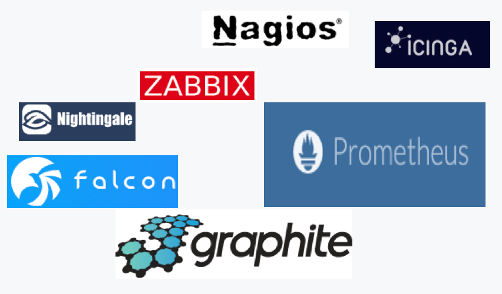
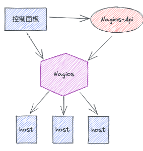
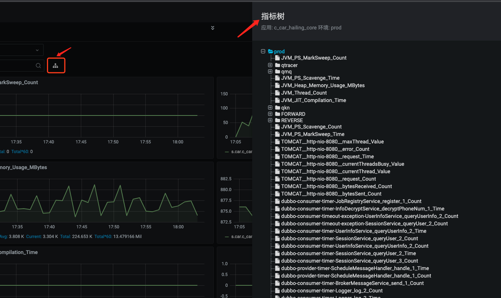
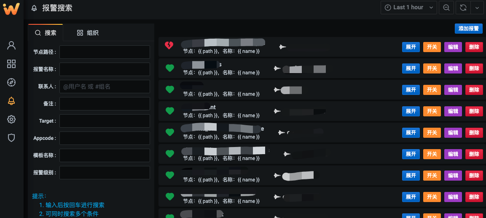
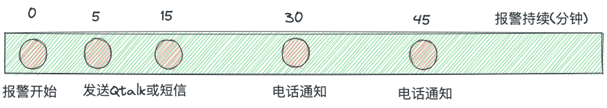
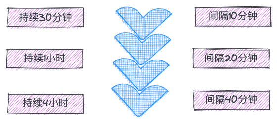
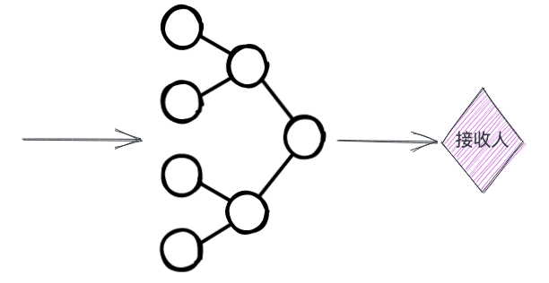
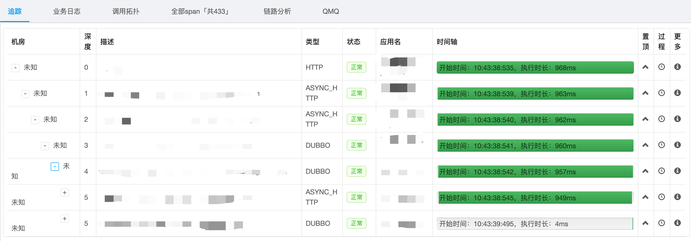

# 监控告警实践

## 1 背景

### 1.1 行业的监控告警有哪些

对于当前的互联网企业来说，监控是必不可少的，不管你的应用运行在物理机还是虚拟机或者容器上，你都需要知道它是否在正常的提供服务，它当前有没有一些异常的状态，它所运行的环境当前是否是稳定的，依赖的外部资源是否正常等等。

而目前整个业界来说，开源的监控系统也越来越多，不同的系统针对的侧重点和特性也不同，像Zabbix/Nagios 这种老牌的监控系统侧重于主机系统层监控和告警，比如Zabbix 和Nagios都自带有一套完善的系统层面监控插件，而且还允许运维很方便的利用Shell脚本或任何其他脚本语言来扩展自己想要的插件，同时Zabbix还提供了比较便利的Discovery功能，创建一套模板后，便能自动发现和检测相应主机状态，省掉了繁琐的配置过程。而 Graphite/Prometheus这样的则更兼顾业务应用层监控，它们提供了一套机制，应用可以在代码里记录自己在运行时的状态数据，然后通过Exporter或者Push的方式将状态数据暴露或推送到Server端，Server将数据存储在时序DB中用于之后的分析、查看和告警等。

很多企业在用开源软件的一个路径大概都是这样的，纯开源使用 → 少量的定制化开发或外层封装 → 深度的二次开发 → 自研。 

Qunar的监控平台早期的时候用的也是用的纯原生方式，是用Nagios+Cacti 的方式结合来做的，Nagios用作基础设施的监控和告警，Cacti则用来看一些趋势图。随着之后的发展这种形式已经不能满足我们的需求，在2014年的时候我们开始设计自己的监控系统，从用户角度看我们要提供统一入口的一站式的监控平台，避免开发在各个系统间跳来跳去，要更友好的支持应用监控，要有更便捷的指标查看和快速定位，要更方便的让用户自己配置告警以及告警升级之类的告警操作等。 基于此我们开发了Watcher监控系统。

Watcher是去哪儿网内部的一站式监控平台，目前每分钟收集存储的指标总量在上亿级，检测和处理的报警量是百万级的。它的开发方式是部分主要组件在开源软件之上进行的深度二次开发加上部分自研组件的方式完成的。由于开发较早当时graphite比较流行，因此后端收集和存储的选型是用的graphite+whisper做的二次开发，前端控制面则基于grafana做的二次开发。因为考虑到数据量比较大，所以我们要求监控体系中任何组件都能够很好的水平扩展。

### 1.2 Qunar监控告警演进

Nagios自身有比较优秀的监控插件扩展系统，很方便运维或开发自己去扩展监控，而且Nagios的告警策略也比较丰富，可以自定义通知策略和通知升级之类的告警操作，但是Nagios自身并不能绘图，也不能查看数据历史，因此早期监控是割裂的，报警和看图是分别在不同的系统。

这里有几个明显的痛点：

1. 监控面板和告警面板是割裂的，甚至在不同系统，开发要想查一个问题，经常需要在不同的系统间跳来跳去。
2. Nagios 和 Cacti的扩展性都不好，不能进行方便的横向扩展
3. Nagios的告警配置比较复杂，学习成本搞，因此需要专门的人来修改配置文件 然后reload才行，开发是不能自己上去配置的，这样要加一个告警效率太低了。
4. 外部系统无法与Nagios进行联动来动态的处理告警问题，比如在发布期间我们想临时把相应的告警关掉发布完成后在打开告警。

首先为了解决专人手工配置告警和外部系统联动的问题，我们引入了Nagios-Api，并在Nagios-Api之上封装了自己的配置管理和告警处理。Nagios-Api自身也是一个开源项目，Nagios-Api通过与Nagios自身暴露出来的 nagios.cmd 管道文件与Nagios通信，可以执行一些Nagios的命令，如开关报警、设置downtime(schedule_downtime)、取消downtime(cancel_downtime)等。配置管理则是由一个应用监听配置请求，当有配置变更请求时，动态变更配置更新Nagios配置文件，在一个窗口期内去Reload Nagios使其生效。这个阶段我们的监控系统变成了这样：

除此之外，早期Qunar快速发展阶段，各个部门的业务、应用和机器也都在快速扩张，这个时候为了不把鸡蛋放在一个篮子里，也为了降低单系统压力横向扩展，就给各部门部署一套这样的监控系统，因此我们的监控架构就变成了下面这样：

到了这个阶段也暴露出了一些问题：

1. 多套系统对于运维和后期开发维护成本都增大了不少
2. 监控面板和告警面板仍然是割裂的，并且在不同系统中，对于开发排查问题难度很大
3. 多系统之间数据不互通，没办法基于此做一些数据分析类的动作
4. 应用监控的需求并不能很好的满足，Nagios毕竟擅长的是系统层监控

## 2 打造符合需求的企业级监控平台

由于背景中遇到的一些痛点，在原有开源监控已经不能满足我们的需求了，因此我们需要考虑建设自己的监控平台。这个平台要能解决几个问题：

1. 提供一站式监控告警的能力
   提供统一的监控告警查看和配置页面，不需要让用户在使用或排查问题时跳来跳去
2. 支持系统层监控的同时，提供更友好的应用层监控能力
3. 支持用户能够自定义自己的监控面板和告警配置，不需要特定的人来管理面板和配置，同时要有权限划分
4. 使用简单
   因为用户是面对全公司的，其中有技术同学和非技术同学比如产品、运营，所以要避免过高的学习和使用成本。

除了这些之外还要考虑一些非功能性要求，比如：要横向扩展能力强，平台不能成为最后排查问题的瓶颈；数据高可用，不能因为挂一台机器导致数据丢失。

### 2.1 平台核心功能设计

watcher作为当前Qunar使用的监控平台，目前监控的应用数三千以上、主机+容器量在十万左右、指标数上亿级、配置的告警量百万级。
前面介绍过，由于前期多个系统，造成我们的数据和控制面都是分散的，开发查指标查告警都是极不方便，所以Watcher基于开源的Grafana做了深度的二次开发，统一整合了监控和告警的配置和查看。由于Grafana本身就提供了很优秀的监控绘图能力和多数据源的支持，并且是非常的灵活，允许用户从各种数据源选择指标数据绘制各种类型的图表并保存下来。但Grafana在企业的使用中也是会有一些不便的，比如：

* 查看指标不够便捷，早期的Grafana是没有Explore功能的，用户在Grafana中查看指标必须要先新建一个Panel，然后在Panel中输入对应的查询表达式才能看到自己的指标，这对于有很多指标，并且只是临时性的查看一次的这种场景来说就极为不便了，因为你不会为每一个指标都创建面板的，尤其是一些异常类型指标，这类指标值需要在异常时才有查看的需求。

- 面板管理不方便，新版的Grafana给面板增加了目录和标签功能，但是对于面板比较多组织架构比较深的时候管理仍然不够便捷，watcher开发了面板树来管理面板和面板权限，同时由于树形结构权限也可以很好的继承
- 没有模板功能，比如在一些主机监控的场景中，我们要查看主机的监控内容基本是一样的，比如主机的CPU、内存、Load、网络、磁盘等等，在这种场景如果每台机器都要手工的配置出来一个面板，那工作量还是很大的，即便是使用Variables能力(早期叫Templating)，在主机量很多时，在下拉框里去搜索使用也很困难。
- 报警功能无法满足企业需求

因为这些原因我们还是选择对Grafana做二次开发，下面介绍下我们平台核心功能设计：

#### 2.2.1 树形结构管理面板

如上图看到的，我们将Grafana扁平化的面板管理改造成了目录树结构的面板管理，这在面板比较多的时候非常有用，而且层级分明对于人记忆和查找都比较友好，同时也提供了搜索功能，可以针对关键字快速搜索自己的面板。同时可以给目录树做更细致的权限管理，比如是否仅查看，查看和编辑，还是无权限访问等，这些权限也可以从父节点继承到子节点。

#### 2.2.2 升级版的Explore

其实严格来讲，我们并没有用Explore的功能，在Grafana的框架上我们自研了适合公司自身的指标查看方式。

在Qunar的应用管理方式中，我们给每一个应用会起一个唯一标识叫做AppCode，AppCode是对一个应用的抽象，它整合了这个应用所有的资源，包括代码、主机、环境、依赖的资源、使用的外部服务、监控和相关Owner等。抽象出AppCode后，我们可以对这个AppCode可以在多个系统进行连通，多系统可以数据共享，而且在各系统设计时统一基于AppCode的概念来设计，这样对于所有人在使用这个系统时候也能降低很多理解成本，比如一个开发在自己的应用中埋了一些监控数据，上报的监控平台，那他在查看自己的监控时只需要知道自己的AppCode是什么就能查看自己的指标数据，如果指标过多时再进行关键字搜索等操作。

比如上图中，用户只需要在左侧的应用树（注意这里的应用树并非上面的面板树，一些公司里面可能叫服务树）搜索或者定位到自己的AppCode，右侧便自动展开对应的环境的指标，自动组装成一个只读面板开提供给用户查看，此面板是即读即消的。可以看到右侧可以选择自己的环境，查看不同环境下的指标数据，同时支持根据正则表达式来搜索自己的指标名，简单快捷。

##### **指标浏览**

如果实在忘记了自己的指标名，也是点击搜索框后面的指标树来浏览自己当前应用当前环境下的所有指标的。如下图：

没错，指标也会被组装成一棵树形，这是因为Graphite的指标命名方式不同于现在的Prometheus 的Tag指标的扁平化形式，Graphite的指标命名也是层级化的，是以 "metic.name.xxx" 这种形式组合成一个Metric，每一个点便是Tree的一级。

##### **指标收藏**

用户可以将自己关注的指标收藏的自定义的分组里，以便以后快速查看某一类指标，比如一个应用的核心指标，我们建议收藏到核心分组里，以便快速查看。

##### 指标模板

正如上面提到的，当你监控了很多主机、容器、交换机路由、防火墙等等设备以及Mysql、Redis等基础中间件信息时，在查看这些设备状态监控时基本关心的东西是相同的，如果每次查看都有手动建一个面板人工成本太高，因此基于这类监控，我们做了模板化，模板化后用户不需要关心怎么创建出来这种面板，你只需要输入自己关心的主机，那么当前主机的所有监控信息就都会展示出来。而当你定位到自己的AppCode时，便会自动列出当前AppCode下主机的监控信息。

#### 2.2.3 告警管理

告警管理模块，解决了两个问题：

1. 统一了告警配置和告警查看，用户不在需要到多个系统查看自己告警，告警依然支持根据AppCode来搜索自己配置过的告警
2. 用户可以根据自己的需求自己添加告警，不需要像早期需要特定的人来添加。

告警管理分为业务告警和主机告警：

1. 业务告警是指用户应用埋点监控的Metrics添加的告警，用户可以任意增加、删除、修改、设置通知联系人等。
2. 主机告警这块我们实现了类似Zabbix的主机模板和Discovery功能，用户可以配置一类主机监控模板，同时设置Discovery规则，一旦当有匹配类别的主机上线，则自动应用这些监控和告警。

下图为告警配置页面

### 2.2 架构选型和设计

Graphite是一套优秀的指标处理和存储解决方案，它自带了数据接收器(cabron-relay)+聚合器(carbon-aggregator)+存储器(carbon-cache)+时序DB(whisper)这样的一套组件，是基于Twisted异步框架开发，最主要的是它的各个组件都可以任意横向扩展，扩展性非常好。因此能够很好的支持大规模指标采集存储。

其数据收集协议也非常简单，协议形式是："metric_name value timestamp" 便是一条指标数据，例如： echo "my.metric.name 1 `date +%s`" | nc serverIP serverPort 就能将 my.metric.name 这个指标上报给Graphite Server端。

原生Graphite仅支持 TCP/UDP Push的方式采集指标，客户端必须封装TCP/UDP 协议来进行数据Push，客户端上报数据有时会变得不可控，加入客户端封装有Bug或者单位时间内需要上报的量非常大时，对于网络消耗和性能消耗都非常大。因此我们自研了Qmonitor，qmonitor类似Prometheus的Exporter，客户端只需要引入一个jar 包或相关依赖，在单位时间内数据只记录在本地内存中，同时向外暴露一个http 协议的url，Server端会定时去抓取数据并做聚合计算，然后在push到 graphite集群存储下来。

下图便是客户端使用Qmonitor 采集数据的流程，客户端只需要引用qmonitor-client相关依赖包，调用API 生成和计算指标即可。Server端则会定期去拉取client端的数据，拉取后会进行聚合计算，然后Push到后端存储。后端存储使用了 Graphite和Clickhouse，Graphite接收和存储普通指标，存储周期长，支持多种存储策略，而Clickhouse用来存储所有的单机指标，这类指标特点是查看的需求少，存储周期短，但是量很大。

对于主机的指标采集，我们使用了开源的collectd 配合采集，collectd内置了采集主机信息的各种能力，比如cpu、load、disk、swap、net等等数据，并且支持graphite 格式的写入插件，这样我们就可以在每台主机上安装collectd agent，collectd可以指定某一个间隔时间比如是30s，每30s 采集当前主机的所有数据信息，并且Push到后端存储。

下图是整体的存储结构图，不管是Push还是pull的方式的采集的指标都会放入 whisper时序DB中，同时数据通过旁支mirror到 relay-index应用，relay-index探测出新增指标，将指标放入索引DB提供给API Server使用

### 2.3 告警治理

#### 2.3.1 报警升级

报警升级分为提醒升级和联系人升级，我们的报警升级没有强制联系人向上升级，但用户可以方便的在树节点上设置联系人（一般在树节点上设置相关负责人），树节点上设置的联系人，其子节点上的告警都会接收到，而且是前面的联系人都没人处理告警的时候（比如没有接听告警电话），才会通知树节点联系人， 因此利用这种形式做联系人升级。

提醒升级是当一个报警开始发送告警通知时，一开始我们只会发送Qtalk提醒，Qtalk属于弱提醒，但如果过了一段时间这个报警仍然没有人处理，就会升级成电话提醒，电话提醒则是属于强提醒。

#### 2.3.2 报警降噪

当配置的告警越来越多，很多告警都不是重要的告警，经过几轮人员更替后，这些告警都会成为极大的噪音，当它报警后，新来的同学不清楚这个告警是监控的什么东西，也不敢随便处理比如关闭告警，于是放任不管，那这些报警就会一直报着，长时间的没有人来出来。时间长了很容易引起相关人麻痹，导致错失重要告警的处理。针对这种情况，我们开发了降噪算法，算法只根据报警开始时间和设置的报警间隔，来计算出当前是否处于发送窗口，只有在发送窗口期，告警通知才能真的发送出去，否则不发送通知。以此达到的效果是 比如：当一个告警设置通知间隔是5分钟，但是持续了30分钟还没有人处理，那么我们会动态拉伸他的通知间隔，逻辑上将通知间隔变成了10分钟，1个小时没人处理则变成20分钟等等依次类推，这个告警持续时间越长，那么通知窗口也会被拉的越来越长，通知的频率就会越来越低，即便是他处在告警中。

#### 2.3.3 闪报抑制

在Qunar，一个报警持续时间小于5分钟的报警我们称为闪报。很多时候我们刚开始配置报警时，尤其是一个新的报警，大家可能对阈值估算不准，或者由于很早之前配置的报警，之前设置的阈值已经跟现在的业务波动不太匹配了，就会导致报警波动、闪报。这种闪报通常来说不影响业务，但是频繁打扰会导致报警接收人麻木。因此抑制的目的就是减少无意义的打扰，尽可能提升报警的精准性。

当前报警抑制的实现方式是观察一个报警一段时间内（目前设置的是24h）报警状态改变的频率，如果频率高于某一个点（这个阈值点是系统根据算法算出并默认提供的，用户可以自己修改）则会进入抑制状态，频率低于某一个点则会退出抑制状态。其中半个小时内的状态多次改变则状态权重递增。

**快速退出抑制机制**：如果最近半小时内检测的状态改变频率低于快速退出频率阈值， 则立即退出抑制状态。
**强制退出抑制机制**：如果在抑制状态中发生了报警，且持续时间超过一定时间，目前设置5分钟，则强制退出抑制状态将报警报出来。

#### 2.3.4 报警收敛

当某一个时刻突然出现了大量告警，这会导致告警刷屏，在去看Qtalk告警消息时，根本就看不过来，一些重点的告警会被淹没掉，或者根本无法确定哪个告警最有可能是需要重点关注的。 在这些告警里一定会有一些告警是因为其他告警造成的，比如一台宿主宕机，主机上的load、disk等告警都会报出来，甚至可能影响到业务指标，导致某个业务指标告警。所以报警之间会有一个隐形的依赖，通常主机或机房层面的告警依赖非常清晰，属于物理依赖，而应用之间也有依赖，应用之间的告警就是逻辑依赖。

所以在做告警收敛时，依赖拓扑是很重要的，物理依赖可以很简单的计算或者定义出来，而多应用间依赖在Qunar可以通过Qtrace来拿到依赖拓扑，因此目前在Qunar当某一时刻出现大量告警时，会触发告警收敛，告警收敛会先在Appcode内收敛，根据依赖拓扑一层层收敛，AppCode内收敛完成之后会进行AppCode间收敛，最终只会将叶子告警发送通知，其他的只在详情页展示，并不真实发送通知。

这里面有一个难点，就是AppCode内配置的多个业务告警怎么拿到依赖关系（依赖树），目前Qunar 将Metrics 和Qtrace进行了结合，Qtrace在记录方法间调用时如果经过的方法内有记录Metric，那么会将这个Metric信息带入到Trace信息里，最后经过洗数分析就能拿到指标间的依赖关系，根据指标间的依赖关系就能拿到告警的依赖关系。比如 一个 http的入口方法 foo，此方法里记录了一个指标就是 foo.access.time，foo调用了 bar 业务层方法，bar业务层方法内记录了一个指标 bar.exec.time，那么指标 foo.access.time 就可以认为依赖 bar.exec.time，如果foo.access.time 和bar.exec.time同时告警，那么只有bar.exec.time的告警会通知出去。

### 2.4 Trace结合

Qtracer是Qunar自研的Trace系统， Qtracer首先是一个全链路追踪系统，可以用来定位跨系统的各种问题；另外，通过收集链路中的各种数据达到应用性能管理(APM)的目的。而监控就是通过Qtracer收集链路数据的特性来做到跟Qtracer结合的。

首先Qtracer提供了QTracer.mark()方法，此方法能够将自己想要的信息关联进当前trace的context中， 然后在我们自研的Qmonitor agent中，在记录指标数据时调用 mark方法，将当前指标标记进当前的Trace信息里面（如果当前有Trace信息的话），以此能达到的效果就是一个带着Trace信息的请求从入口进来（如果没有携带Trace信息，可以生成Trace），经过了foo() 方法，而foo方法中记录了指标 foo.access.time，那么 foo.access.time 指标会被 mark到当前Trace信息中。

数据被mark进来后，当前会以日志的形式落盘，然后经过洗数，最后会将Trace的Trace Id 和当时经过的Metric Name的关联信息存入到ElasticSearch中便于后期检索使用。

当这些数据信息都没有问题的时候，此时比如我们在 foo.access.time指标上加了一个告警，一旦指标告警，我们就可以检索出告警的这一段时间内所有的Trace信息，通过Trace信息能够快速的反应出当时请求的状态，以此来协助开发或应用Owner快速定位问题。

下图是在Watcher上拉取当前告警时间段的Trace Id信息:

点击Trace Id 可以查看具体的Trace信息，以及调用拓扑等

## 3 云原生时代监控平台的演进

2021年时，去哪儿网在公司内部进行了大规模容器化部署，到目前为止去哪儿网大部分的应用都已经运行在内部的多个Kubernetes集群上。在这样一个背景下早期我们许多根据kvm特性的相关设计也要跟着变化，比如容器跟kvm最大的一个变化便是动态IP问题，kvm的主机一旦申请后IP是固定的，且kvm主机的生命周期远远长于容器，通常是跟AppCode同生命周期，而容器生命周期则非常短，每一次变更发布都会导致容器IP变化，这种频繁变化给周边系统带来了许多问题，因此周边系统也需要进行改造以应对这种变化。

### 3.1 业务指标数据采集

上面提到过Qunar的业务监控使用的Qmonitor进行埋点和暴露数据，虽然Prometheus有自己的Client，但是想要让全公司的应用从Qmonitor改成Prometheus Client显然不现实。而Qmonitor早期设计是针对kvm的流程设计的，比如用户在通过Qmonitor监控时我们自动拿到对应的需要监控的主机名或IP，然后通过Pull当前主机对应的url才能拿到监控数据。而容器的IP是经常变化的，因此我们修改流程，增加了Discovery的功能。

首先我们增加了事件监听器，用来监听和收集所有k8s集群的事件，然后将这些事件存储到DB的同时发送到mq中，其他应用可以监听mq来拿到自己想要的事件。然后在qmonitor 增加 client-discovery模块，此模块可以监听对应的消息事件，然后动态的更替对应的ip和meta信息，更新的数据提供给 qmonitor server来使用。这样便能动态的发现和变更对应的client地址，而且对业务无感知。

### 3.2 基础设施层监控

云原生时代，我们的基础设施层由kvm云变成了容器云，kvm时我们使用的collectd+graphite 来收集基础设施相关的监控，比如cpu、磁盘数据。collectd是一个agent需要安装在kvm server上，但是容器内通常只有一个进程，agent的形式是不友好的。而k8s层的相关监控我们使用 prometheus+cAdvisor，k8s自身便是使用 prometheus client来export内部的状态数据再配合使用cAdvisor监控容器运行时的状态数据比如cpu、内存。

#### 3.2.1 指标模板集成

我们的Dashboard是根据Grafana做的二次开发，而Grafana本身就支持很多的数据源插件，其中便包括Prometheus，因此能够很方便的将prometheus集成到Watcher Dashboard上，集成后依然提供对用的Pod模板查看，允许用户直接通过自己的AppCode就能查看到自身应用下当前的pod状态，以及应用级的pod状态。

#### 3.2.2 容器告警

容器的告警像kvm一样，也支持模板化，容器通过监听事件来将模板应用到对应AppCode上实现动态添加告警，模板包括了检测指标、检测规则、告警阈值等信息。由于Prometheus自身支持异常检测，因此可直接将告警规则通过prometheus crd同步到prometheus，通过配置，Prometheus检测到异常后，会将异常信息Push到 我们自研的Alert-API模块，Alert-API可以说是prometheus 到icinga的一个转换器，Icinga是我们真正的告警管理模块，支持开关报警、告警升级等策略，Icinga类似Nagios，但是icinga提供了更友好的API操作入口。

## 4 总结规划

上文详细讲述了去哪儿网监控告警平台的实践过程，从一开始的Nagios+Cacti 到现在的Watcher，我们以企业需求为出发点来设计和落地监控平台。其实可以看到监控从最初的只要能帮助我们发现问题这样的基本需求，到现在我们更期望它能帮我们快速定位问题甚至是解决问题，比如很多公司在实践的根因分析和故障自愈等，近期我们也在做这方面的探索。

另外的在当前高度自动化时代，监控系统的用户很多时候会从人变成程序，监控系统慢慢的会像CMDB一样演变成更高层工具的数据基石，向外提供出自身的数据和分析能力，比如在去哪儿网实践的混动工程、全链路压测、发布驾驶仓等都需要用到监控的时序数据和告警数据来做断言或者熔断。

