# 测试环境治理实践

## 1 背景

公司业务的迅猛发展离不开项目的快速迭代，为确保项目有序快速的迭代上线，需要PM、DEV和QA在测试阶段不断地优化、验证和调试产品的流程、代码，直至满足上线标准，最终发布上线。在整个迭代过程中，稳定的测试环境为项目顺利交付提供了最基础的保障。

在去哪儿我们采用微服务架构，因此对于一个需求的变更可能会涉及很多应用、DB等，即使涉及几个，但是我们在验证的过程中也需要搭建一套完整的业务环境保证整个业务逻辑的完全回归；再次业务迭代非常频繁，因此我们常常会面临并行开发测试的问题，而一个需求的测试必须保证该业务流程的完成覆盖，因此对于某一块业务存在同时搭建多套环境的需求，基于以上两点我们需要有快速搭建环境的能力，但是现实却非常残酷，环境成了项目delay、测试覆盖不全的主要因素，纠其原因主要有以下两点：

- 环境搭建成本高：需要对业务流程比较了解，如应用之间的调用关系，其次需要了解每个应用的服务依赖、启动方式、其他依赖等，通常搭建一套环境至少需要一整天的时间，如果需求并行量小的话大家还能接受，但是经常的需求并你                                                                                                                                                                                                                                                                                                                                                                                                                                                                                                                                                                                                                                                                                                                                                                                                                                                                                                                                                                                                                                                                                                                                                                                                                                                                                                                                                                                                                                                                                                                                                                                                                                                                                                                                                                                                                                                                                                                                                                                                                                                                                                                                                                                                                                                                                                                                                                                                                                                                                                                                                                                                                                                                                                                                                                                                                                                                                                                                                                                                                                                                                                                                                                                                                                                                                                                                                                                                                                                                                                                                                                                                                                                                                                                                                                                                                                                                                                                                                                                                                                                                                                                                                                                                                                                                                                                                                                                                                                                                                                                                                                                                                                                                                                                                                                                                                                                                                                                                                                                                                                                                                                                                                                                                                                                                                                                                                                                                                                                                                                                                                                                                                                                                                                                                                                                                                                                                                                                                                                                                                                                                                                                                                                                                                                                                                                                                                                                                                                                                                                                                                                                                                                                                                                                                                                                                                                                                                                                                                                                                                                                                                                                                                                                                                                                                                                                                                                                                                                                                                                                                                                                                                                                                                                                                                                                                                                                                                                                                                                                                                                                                                                                                                                                                                                                                                                                                                                                                                                                                                                                                                                                                                                                                                   行环境抢占就成了问题，即使多建几套环境，但是由于链路比较长，当没有需求的时候，环境资源的占用也是一个不小的浪费；
- 环境维护成本高：搭建固定环境，就需要及时的对环境中的应用版本进行更新，应用的依赖变更、组件升级等也需要及时更新，一旦更新不及时很可能导致测试过程千奇百怪的问题，严重拉长了开发测试的周期，影响交付的速度；而且环境的维护对人员的技术和经验背景要求非常高，一旦人员流动，环境很可能就不可用了。

基于以上问题，我们开始搭建内部的环境治理平台，以提升一线工程师工作效率为最大目标，以环境搭建为切入点，集系统编排、资源分配、环境创建、应用部署、并行测试和资源管理等功能于一身，历时6年时间，主要经历了3个阶段:

- 第一个阶段是支持环境定义并自动化构建，主要减少人工搭建/维护环境的成本，通过环境模版快速创建一套完整的测试环境；同时通过环境网络/配置动态隔离，达到多套环境并行存在，多个需求并行测试的目标；
- 第二个阶段是测试环境支持动态路由，主要解决多套环境引入的资源成本膨胀及维护多套环境成本据增的问题。通过SoftRouter机制减少资源占用及日常维护成本，并增加环境巡检机制，保证环境的高可用性；
- 第三个阶段是支持本地开发联调，通过IDE插件将本地环境跟测试环境联通，提升开发自测的效率。

经过几年的建设，当前的平台架构如下

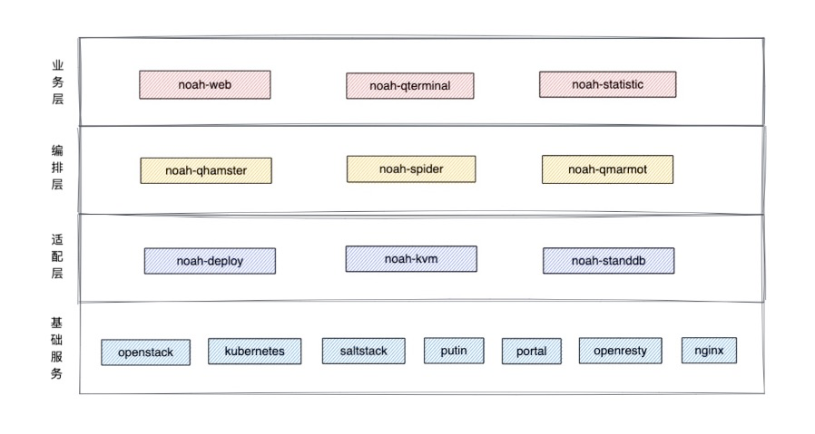

平台主要包括四个部分

- **业务层** 主要提供环境管理/模版管理/服务管理/业务线管理/计划管理/数据分析等功能
- **编排层** 主要包含环境构建任务编排与执行/服务间依赖关系收集。
- **适配层** 主要提供对环境所依赖的网络/存储/资源平台的适配
- **基础服务** 主要包含资源平台/SaltStack/七层负载均衡/发布平台/存储相关操作平台

以下我们从演进过程来介绍我们整体的环境治理方案。

## 2 阶段一：自动化环境交付

第一阶段我们首先要解决的是人工便自动的过程，也就是整个环境治理体系过程，所以我们首先需要对环境进行清洗的定义，其他我们还要明确最终的交付形态，以下从这两方面分别介绍。

### 2.1 环境定义和组成

由背景部分介绍，我们的环境需要能够支持某一块业务的测试验证，因此一个环境通常是包含多个应用及其依赖（DB，中间件）组合，同时为了保证能够提供多套测试环境，需要进行网络隔离，因此我们的一个环境包含如下5部分内容：

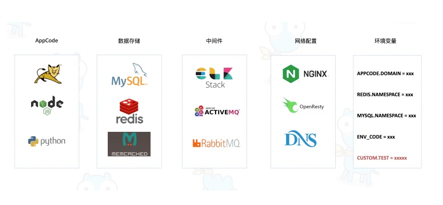

- **AppCode** 指代一个服务的唯一标识及该服务的基本信息/发布配置/依赖配置/运行时配置，主要开发语言涉及Java/NodeJs/Python/Go
- **数据存储** 主要包含对于主流存储组件的支持，例如Mysql/Redis等
- **中间件** 主要包含对于主流中间件的支持，例如ELK组件/RabbitMq/ActiveMq等，并提供灵活的扩展能力
- **网络配置** 主要包含Openresty/Nginx/Dns等服务
- **环境变量** 主要维护环境内部服务/中间件生成后产生的环境变量信息并支持用户自定义，用于环境内服务的互联互通及环境间服务的隔离

为了保证的快速交付，我们增加了模版功能，即用户可以先将一套环境定义为模块，当需要创建环境是从模版生成，这样避免了并行需求每次重复配置的成本浪费，也解决了个性需求配置修改对所有并行需求的影响问题。

#### 2.2.1 AppCode画像
我们最终的目的是交付一套可用的测试环境，同时实现环境的日常自动运维，因此需要知道应用的运行时等相关信息以便实现环境的快速交付，我们内部称之为AppCode的画像，主要包含三个部分：资源配置/发布配置/运行依赖配置，资源配置包含kvm/容器类型，以及系统版本/实例个数等配置

#### 2.2.2 数据存储
除应用外，为了保证测试环境的数据隔离，会将应用依赖的数据存储也作为环境的一部分，在去哪儿，我们主要使用的是Mysql和Redis，以Mysql存储为例，在测试环境建立基准库实例，实时同步线上Mysql集群只读节点数据至beta环境，同时提供基准库（逻辑概念）供用户拉取不同集群的库表信息，在环境创建时，从基准库实例fork出测试库实例，并分配namespace，供环境内服务使用。

#### 2.2.3 中间件

某些应用由于特殊的业务属性也会依赖一些中间件，比如es,ng等，因此我们也将其纳入环境管理；当前支持的中间件包含多种开源项目，同时支持自定义SaltStack/Shell相关脚本，满足日常扩展需要，这些中间件都会在环境创建过程自动创建；

#### 2.2.4 网络配置

网络配置方面，支持域名网关自定义配置（底层为Dns + Openresty）,同时支持自定义nginx，满足日常扩展需要。

#### 2.2.5 环境变量

环境变量主要是由环境内各种类型的服务生成的kv对，同时支持用户自定义环境变量，供AppCode类型服务进行引用。AppCode类型服务在部署前会将部署目录下的配置文件以环境变量作为数据源进行替换，生成运行时配置，达到环境逻辑隔离效果。

### 2.2 环境交付

在交付环境时并非只需要将环境定义出来即可，我们更需要的是将部署好的可用的环境交付给开发测试同学，因此我们基于上述定义好的环境实现了自动构建，即将环境中的定义实力化，包括应用版本、中间件、数据库依赖性等，下图是整体的构建流程：

**整个环境的构建流程实际上是一个DAG(有向无环图)，如下图:**

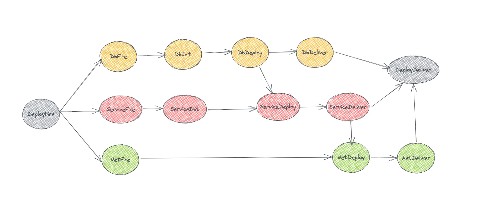

整个环境构建流程实际上可以理解为一个分布式任务调度流程，Noah环境在构建之前根据各个组件的依赖关系进行编排后生成一个DAG(有向无环图)任务交由分布式任务调度系统Ceres（公司自研），Ceres服务启动构建，开始完成图上的所有任务的执行，执行完成后环境即被创建成功。

## 3 阶段二：动态路由机制

#### 3.1.1 背景分析
经过第一阶段的建设，环境管理平台已经覆盖大部分业务线，业务线同学使用业务线模版生成多套环境，环境间相互隔离，依赖多套环境达到并行开发及测试的目的。然而此种使用方式存在以下几个问题:

- 环境资源成本占用过大，我们的环境不仅用于人工测试，也用于各种自动化工具，因为环境获取的成本降低，因此大家在使用量上也大幅提升，虽然我们做了及时销毁等策略，但是日常占用的成本依然非常巨大，不完全统计，内存暂用在10个T以上；
- 多套环境日常维护人工成本比较大，日常的版本更新、组件更新等耗费成本，不及时更新等原因也为问题定位的效率等造成了影响；
- 环境可靠性难以保障，我们日常并行使用的有上千套环境，大部分测试环境需要在项目期间持续使用，然而每天有近千条变更在线上环境产生。这些变更若不能及时同步到beta环境，那么测试质量显然⽆法得到有效保障，我们急需自动化的检查及自愈机制。

为了解决上述问题，我们调研了行业里相关的解决方案，引入了软路由机制（也就是行业里的甬道环境）、基准环境日常巡检和实时同步、测试环境基础资源巡检与自愈方案。

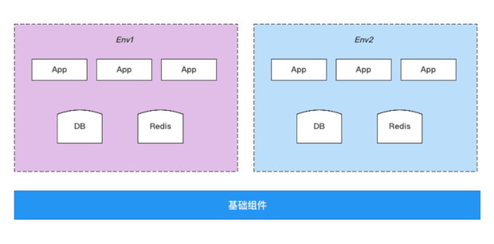

#### 3.1.2 方案设计：软路由机制
如下图所示，多个环境并行测试情况下，黄色部分服务是待测试的服务，然而白色部分的服务都是用来支持整个链路测试的服务，测试链路越长，浪费的资源越多。

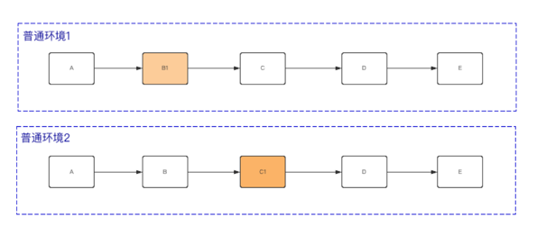

动态路由设计基于QTrace(去哪儿网全链路追踪技术)，通过在各端(APP/PC/小程序等)取到ID标识，将流量进行染色，然后在Http/Dubbo/Mq各个通信中间件层面根据染色标识进行动态路由，这样我们只需要保证一套完整的环境也就是基准环境，其他日常测试环境都采用动态路由的方式，那么原来如果需要7套环境，每个环境10个应用，总计的70台机器变成软路由方式就变成了17台（假设每个环境只测试一个应用），这无疑大大提升了资源的利用率也降低了日常运维的成本。

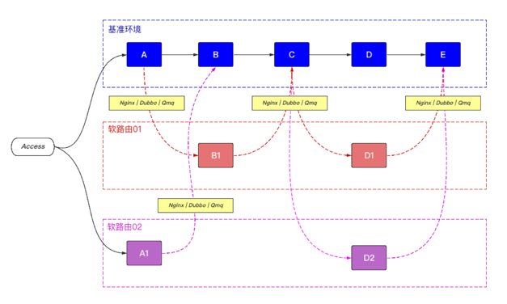

入口流量如何染色? 测试阶段入口总计包含如下图三种入口，如果我们根据身份标识/设备标识，则可以区分用户的测试流量。

接下来我们需要做的是如何将用户测试流量绑定到软路由环境上，从而对用户流量进行动态路由，引导流量进入逻辑测试完全链路上面。

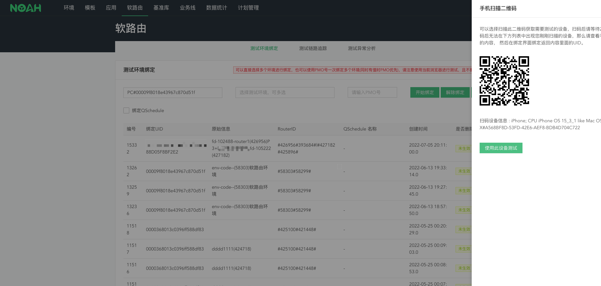

如上图所示，我们提供了扫码工具一键绑定软路由环境，绑定完成后，Noah会生成路由标识信息，并将路由标识信息推送给Openresty/Nginx七层负载均衡组件。当客户端/浏览器/小程序发起测试时，则会经过七层负载均衡组件，负载均衡组件根据设备标识/路由标识映射关系，将路由标识放入http header中，完成流量染色。

我们是如何做到动态路由的? 以Http为例（公司内部主要使用Openresty/Nginx作为七层负载均衡组件）

如上图所示，测试平台在软路由环境创建完成时，会针对基准环境内域名完成location/upstream组的添加，当测试流量到来的时候，Openresty/Nginx会取Header里面的路由标识信息进行location匹配，若完成匹配则会打到对应的软路由环境的Upstream上面，若匹配失败则会将流量打到默认的基准环境Upstream上面。完成http流量的动态路由。

#### 3.1.3 方案设计：实时同步及日常巡检
由上述软路由方案介绍可知，日常的测试除了本次变更的应用外其他都会动态路由到基准环境，因此对基准环境的可靠性和新鲜度要求非常高，基准环境必须要及时的将所有应用的变更及时的同步下来，因此为了达到这两个目标我们增加了日常巡检方案和实时同步方案，会对环境进行定期巡检也会对线上变更进行实时监控，及时的将线上服务所产生的代码 / 配置 / 数据 等变更，进行同步，且同步期间，基准环境服务不中断。因此，特别选择三个方案进行选型。

1 基准环境采用双机滚动部署机制

优点：
- 1 双实例保障基准环境日常服务稳定性
- 2 双机滚动升级，机器不需要被替换，日志信息可以进行保留
- 3 改动成本低

缺点：
- 1 双实例日常日志排查效率较低

2 基准环境采用双机滚动部署，日常单实例提供服务

优点：

- 1 双机滚动升级，机器不需要被替换，日志信息可以进行保留

- 2 改动成本低

缺点：

- 1 发布期间，日志分散在多台实例，随着发布频次增加，问题会被放大

- 2 日常稳定性较差

3 基准环境服务流量切换方案

优点：

- 1 利用软路由环境机制验证日常变更是否可以合并进基准环境，间接提升链路稳定性

缺点：

- 1 历史日志随着机器被换新会丢失
- 2 日常稳定性较差

为满足以下目标，我们最终选择方案一。

- 1 基准环境服务不可中断
- 2 提升软路由链路日常问题排查便捷性，以及日志查询便捷性
- 3 更低的开发成本

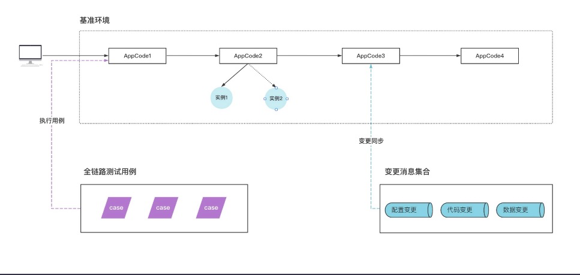

环境链路可靠性巡检通过收取线上(代码/配置/数据)变更，自动同步至beta基准环境，通过收取线上日志并进行筛选生成case，在beta基准环境进行回放，完成对核心链路的日常巡检。

#### 3.3 方案设计：基础资源巡检与自愈
为了高效利用资源，我们的测试环境机器都进行了超售，因此测试环境大量机器资源性能/稳定性等表现都不如线下环境，所以会经常出现资源不可用从而影响测试环境使用，因此为了提高测试环境稳定性，需要提升环境各类资源的健康度可观测性，同时针对异常场景期望做到自动恢复，以下是我们的详细方案：

环境检查处理流程:收集环境内基础资源的各项指标并进行分析生成健康度报告

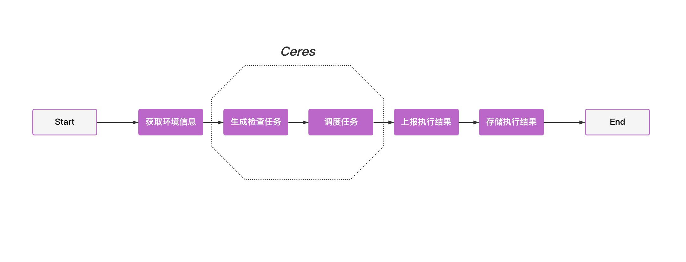

环境自愈处理流程:接收异常事件并进行自动化恢复（以KVM磁盘告警处理为例）

通过环境日常基础资源巡检，并搭配针对各种异常场景的自动化处理机制，提升整个环境基础资源的稳定性，从而提升日常业务测试的稳定性

## 4 本地化开发测试

#### 3.4.1 背景分析

经过前两个阶段的建设我们已经可以快速的交付一套可用的环境而且能够保证环境的可用性和新鲜度，但是回归到我们的环境使用者，大部分用户是开发同学，开发同学在新开发功能时通常首先会在自己本机进行环境的准备，因此他们更希望直接复用本机环境，这样也节省了学习和配置成本，基于此我们展开了对于测试环境本地化开发的探索与实践。

#### 3.4.2 方案设计

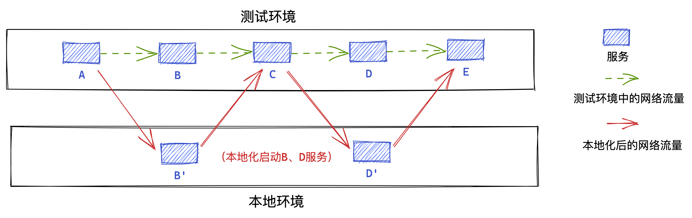

所谓本地化，即将开发者本地PC融合为测试环境的一部分，让开发的目标服务在本地启动且达到与在测试环境中运行的同样效果。

#### 3.4.3 实现原理

去哪儿网的Java Web服务使用的服务容器是Tomcat，并使用Maven组件进行工程管理。因此，我们开发了一套Maven插件来实现对本地网络与服务的注册，并在编译期完成对环境变量的拉取与替换；同时，通过Java Agent技术在服务本地启动时完成本地网卡的识别与上报，并自动将测试环境中配置的host信息加载进本地的JVM中。

1. **本地网卡的识别** 由于现如今大多数的PC机都配备了多块网卡，因此，对于使用到本地ip的相关绑定操作时(如测试环境域名的ip映射、Dubbo服务使用ip注册)，依赖对于使用本地化网卡的正确识别。在本地化的初始阶段，Java Agent会向Noah服务端发起一个请求，服务端会将请求的ip作为结果返回，从而获取到启动本地化用到的网卡ip。

2. **Host信息自动加载** 在某些场景下，测试环境会通过配置Host信息来应对代码中写死固定域名的情况，在本地化使用中，Host信息同样需要加载到本地来完成正确的域名ip映射。Java Agent会在本地化启动时，向Noah服务端请求对应测试环境中的Host配置信息，并加载到本地JVM中，从而不需要用户手动对本地Host进行修改。

3. **环境变量的拉取与替换** 诸如数据库Namespace用户名密码等配置信息，都是维护在不同Profile所对应的配置文件中，代码会在发布过程中识别对应的Profile并完成相关环境变量的替换。由于本地化的本质是将本机服务替换掉测试环境中的服务，因此，本地化启动时需要获取对应测试环境中的环境变量配置。本地化Maven插件通过在工程编译期请求Noah服务端对应测试环境的环境变量信息，以自动完成编译产物中相关配置文件的环境变量替换操作。

4. **服务注册与upstream替换** 要完成完整的链路测试，测试环境内其他服务的流量也同样需要正确地转发到本地服务中。因此，本地服务需要注册到对应的测试环境中，并将域名的upstream进行替换。Maven插件在本地化启动阶段，通过向Noah服务端发起注册请求，来完成测试环境中对应服务的所有上游转发的替换。

至此，本地启动的服务就完成了对测试环境中对应服务的本地化实现。可以看到，无论是Host信息替换还是环境变量的替换，都是在即时产物(JVM、编译产物)中进行的，因此，本地化对于工程代码是无侵入的。

## 5 总结和展望

### 5.1总结

以上即使我们环境管理上的三个阶段的探索，回顾这个历程，我们经历了许多波折，也踩过了很多坑，胆汁最终还是落地了可靠的环境管理方案，总结起来最大的原因是我们在着手之前明确的定义了我们要解决的主要问题，而且所有的设计方案都是基于目标定义，而不是为了搭建一个平台，所以前期的问题分析、目标定义是我们走向成功的关键一步。

### 5.2近期展望

目前我们的测试环境已经能为整个公司的日常测试提供保障，但是我们的环境还是限定于某一个业务领域，但是随着业务的复杂性提升，业务的边界可能越来越模糊，比如机酒打包，订单和售后打包等，基于此我们未来计划打造一套稳定的线下仿真环境(Beta基准环境)。通过收集线上变更同步至Beta基准环境，并根据线上日志自动生成Case(通过自动化手段提升Case覆盖度)并将Case在Beta基准/子环境进行回放，减少人工维护测试环境的成本，并提升测试效率。通过本地化机制打通本地PC与beta基准环境连通性，从而提升开发自测效率。

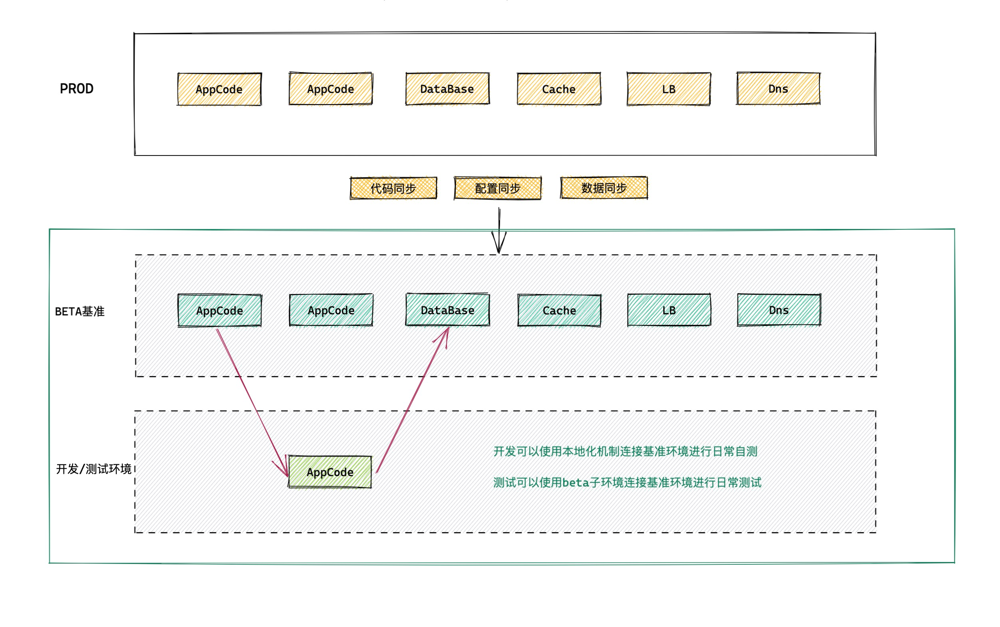

