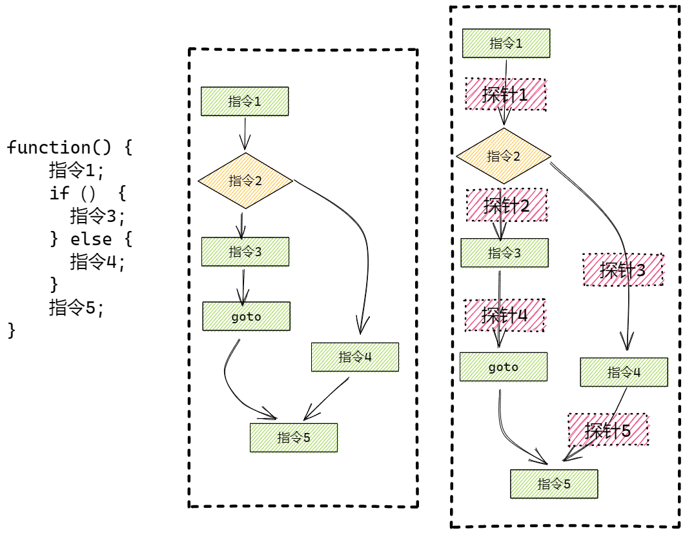
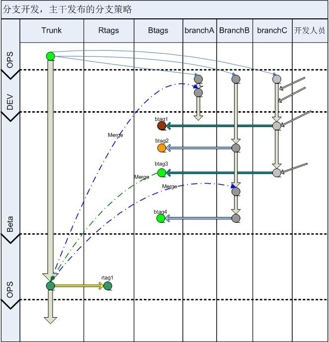
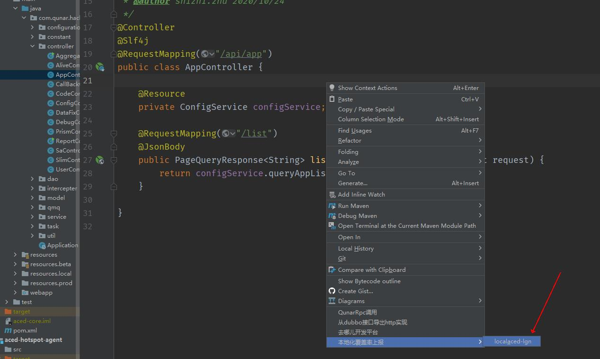

# 1.背景与收益

伴随业务的不断完善，企业已经跳过快速扩张的阶段，更加重视服务质量与用户体验，因此我们做了很多质量建设，包括接口自动化、UI测试、单元测试、静态代码扫描等，同时也落地了质量门禁与发布集成，进行检查拦截，但是即便如此仍然故障频发。对故障原因进行分析，我们发现近两年有超过三分之一是因为漏测造成，这无疑会被大家质疑我们质量建设的效果，总结分析根本原因是质量保障要保证验证覆盖度，而像去哪儿这样体量的公司经历了长久的发展演变，业务非常复杂，因此我们做质量建设的时候通常是优先保障核心应用链路的，这就导致虽然辛苦建设还是会有遗漏的问题。基于此我们在想历史包袱治理的成本太高，而且在业务快速发展的大环境下我们也不可能完全停滞进行全量的治理，因此我们最主要的还是控制新增变更的质量，前边已经说到手段已经建设完成，现在要做的就是保障手段在新增变更的执行，这时候测试覆盖率就变成了一种非常好的手段，虽然覆盖到了不一定有问题，但是没覆盖到更容易出问题，因此从21年开始我们进行了测试覆盖率的建设，当前覆盖率平台已经被我们纳入提测上线前必须的质量保障步骤，同时也被广泛应用在更多的场景：如接口自动化case补充的参考、代码review的范围参考等，成为开发过程质量建设保障不可缺少的重要组成服务，而且统计数据，当前发布故障中，代码漏测得到了大幅的改善，占比由37% 降低至 8.3%。

# 2.实践框架

覆盖率的建设经历了两个阶段，开发落地与降本提效：

**开发落地**

包括了调研、开发、集成CICD与落体过程，全面落地需要考虑落地对用户无干扰，平台性能，存储磁盘问题，更需要考虑覆盖率agent对业应用是否产生哪些影响；踩过的坑，以及如果优雅的解决；截止2021年初，覆盖率平台也作为基础能力覆盖所有业务线，默认全部应用开启覆盖率，应用接入数占比98.96%。

**降本提效**

推广落地后面要做的是用户体验提升，提升覆盖平台数据的精准度与效率成为了首要任务。经过大半年的优化，到2021年底，发布质检平台中，覆盖率拦截数值比例由30%左右提升至70+%。

以下我们从这两个阶段分别介绍。

## 2.1阶段一：实现落地
开发阶段我们结合了公司内部的技术栈以及当前市面上解决方案，避免重复造轮子最终采用开源工具作为基础，集成到CICD中，并实现代码分支覆盖数据合并，与多维度查询功能。落地过程也出现多种特殊场景，如启动失败，业务报错等一系列问题。面对复杂的业务应用，我们踩过了很多坑，通过升级改造得到了很好的解决，以下对实现过程进行详细的介绍。

### 2.1.1覆盖率简介

覆盖率的基本原理如下：

- Java文件编译后的文件由一条条指令组成；

- 覆盖率工具在每一条指令后插入一个标识，常见boolean类型，默认false；

- 请求进入系统后，该标识会设置为true；

- 将标识数据保存到下来，可以保存本地文件或 TCP DUMP方式获取；

- 结合class文件与插装标识生成覆盖率数据；再结合源码可以生成可观察的报告文件；


​	插桩指令示意图：



### 2.1.2工具选型

公司技术栈以java为主，市场上主要的覆盖率工具有：Emma、Jacoco、Cobertura

功能对比：

| 类别       | Jacoco                       | Emma                         | Cobertura                             |
| ---------- | ---------------------------- | ---------------------------- | ------------------------------------- |
| 原理       | 使用ASM修改字节码            | 可以修改Jar、Class文件字节码 | 基于Jcoverage。基于ASM框架对class插装 |
| 覆盖颗粒度 | 方法、类、行、分支、指令、圈 | 行、块、方法、类             | 行、分支                              |
| 插装模式   | on-the-fly 与 offline        | on-the-fly 与 offline        | offline                               |
| 缺点       |                              | 不支持JDK8，不再运维         | 关闭服务器才可以获取覆盖率报告        |
| 性能       | 快                           | 较快                         | 较快                                  |

插装模式:

- **onthefly**: -javaahent参数指定特定的jar文件，启动instrumentation的代理程序
   --更方便，不用提前进行字节码插桩，无需考虑classpath的设置
   --以下情况不适用：部署环境不支持javaagent，部署环境不允许设置jvm参数，动态修改字节码过程中和其它agent有冲突，无法自定义用户加载类
- **offline**: 在测试前先对文件进行插桩，然后生成插过桩的class或jar包。

最终决策：

结合我们的场景、最后我们选择Jacoco作为覆盖率收集工具，采用java agent动态插装模式，降低插装对发布耗时的影响，如期地完成了开发与落地。

### 2.1.3平台建设

#### 2.1.3.1分支模式

由于分支模式对于我们覆盖率的实现方案有很大影响，因此我们先简单介绍下去哪儿的分支方案，我们主要采用分支开发，主干发布的方式，即master跟线上保持一致，当有新需求时就需要从master拉出来一条feacher分支，每次测试验证部署都会生成一个btag，测试验证是在btag上进行，最终上线前将分支的变更（所有btag内容）merge到master上。




#### 2.1.3.2平台设计

当我们对一个需求进行提测或者上线时，我们需要观测的是本次分支所有变更的覆盖率总和，因此需要将支持多次测试（所有btag）的覆盖率数据汇总，因此整体的架构流程图如下：


**备注**

由覆盖率原理的介绍我们知道，生成报告需要三份数据。

- class数据在发布平台获取war包解压；触发时机：收到发布成功的mq消息开始获取，一次性；
- 源码数据在git平台获取；触发时机：收到发布成功mq，开始获取，一次性；
- 覆盖率数据通过ip与端口dump存储；触发时机：用户查看数据时，实时触发，可多次获取，数据追加。

**部分功能细节介绍**

- 业务迭代过程存在大量代码不易测试，业务开发过程只关心修改后的方法测试，因此获取git源码时，需要做gitdiff，数据入库；

- 代码覆盖率只关心项目中的源码，因此需要根据pom解析出源码模块，将第三方jar包去除；

- 覆盖率报告支持全量报告与增量报告，因此class拉取后保存全量同时，再根据diff数据生成变更的class文件；

- 容器或KVM销毁时，避免覆盖率数据丢失，需要主动获取数据；

- Jacoco源码需要拉取改造，支持diff数据以及报告展示；


### 2.1.4落地坑点

由于业务应用复杂，嵌入agent启动过程会出现各种问题，下面介绍两个大坑

#### 2.1.4.1反射天坑

**背景：**

Jacoco覆盖率实现原理是字节码插装方式，在业务Class中插入$jacocoData 字段、$jacocoInit方法。

参考代码：org.jacoco.core.internal.instr.InstrSupport

```java
/**
 * Name of the field that stores coverage information of a class.
 */
public static final String DATAFIELD_NAME = "$jacocoData";
/**
 * Name of the initialization method.
 */
public static final String INITMETHOD_NAME = "$jacocoInit";
```

**问题：**

业务线代码存在较多反射逻辑，误将覆盖率插装字段获取出来，出现应用启动失败以及对外接口错误造成故障等问题。

**解决方案：**

- 修改jvm反射类中的反射方法，在通过反射获取属性以及方法时，过滤$jacoco成员；

- 反射获取DK反射类sun.reflect.Reflection，通过asm字节码修改，达到修改反射方法的目的；


**注意点：**

- JDK11与JDK8中的反射类路径不一样，需要再次处理，JDK11中路径jdk.internal.reflect.Reflection#filter；
- jacoco自身也使用反射类，过滤时需要保障jacoco使用正常；

#### 2.1.4.2端口相关问题

-  端口占用：历史应用使用KVM部署，存在端口使用不规范，需要检查端口占用情况，避免启动失败：
- 多应用部署：KVM的beta环境，业务线为了使用方便出现多个应用部署在一个实例上面，需要支持同ip多端口；
- 访问权限：多端口访问，注意访问权限问题；

#### 2.1.4.3性能与存储

- 无脑git clone既耗时，又占用大量磁盘，注意设置仅clone一层。

- TCP dump耗时较长，特别容器化后ip众多，注意标识失效的ip，可以节约大量时间，当然并发拉取是必须操作；


### 2.1.5应用场景

代码覆盖率我们有很多应用场景，主要包含以下几个场景：

- **发布流程强卡点：**我们的开发上线过程存在多个阶段，需求提测前开发需要自测；上线前，QA需要验证测试，在不同的阶段我们把测试覆盖率数据作为了流程传递的强卡点，同时根据测试人员的专业技能和投入成本，我们为不同的阶段设置了不同的拦截标准，以下是我们的卡点阶段和标准值：


阶段 | 拦截指标与阈值                           
---|---
 提测发布 | 1. 行覆盖度：50%  <br>2.分支覆盖度：30% 
 线上发布 | 1. 行覆盖度：75%  <br/>2.分支覆盖度：50% 

- 接口自动化测试覆盖度参考；
- 接口自动化回归覆盖度参考；
- codereview测试覆盖度参考；
- 线上应用覆盖率数据展示，业务线参考进行系统瘦身；
- 本地化覆盖率数据上报；

### 2.1.6效果展示

#### 2.1.6.1执行数据

| 指标           | 触发       | 耗时   |
| -------------- | ---------- | ------ |
| 质检触发       | 30万次/月  | < 0.7s |
| 项目管理触发   | 20万次/月  | < 0.8s |
| 自动化触发     | 15万次/月  | < 0.5s |
| 覆盖率数据收集 | 100万次/月 | < 0.1s |

#### 2.1.6.2**报告展示**


如图展示，报告中记录变更代码行与对应的方法；未变更的方法不统计；提升一定量的精准测试，降低测试难度。

## 2.2阶段二：降本提效
由于覆盖率被作为研发流程的强卡点，因此测试达标标准的覆盖率数据就成为开发与QA必须要保障的步骤，但是我们要做的事效率和质量的平衡，因此除了完善自动化测试平台，我们还需要尽可能给开发测试提供更精准与便捷的测试方式，以下介绍三个主要的尝试。

### 2.2.1重复测试成本优化

#### 2.2.1.1业务痛点

开发与QA作为工具的使用者，抱怨测试过的方法，发布几次后覆盖率消失了，需要平台识别并保留没有变更的方法覆盖率数据。

开发在发布测试过程中，历史测试过的方法，期望覆盖率保留，不进行重复测试；这要求覆盖率保留到方法级别。

#### 2.2.1.2痛点原因

分析根本原因是jacoco原生覆盖率数据存储结构过于粗糙，数据中以整个文件为单元存储覆盖率数据。文件任何文本变更造成整个文件覆盖率均不可复用，反之则可以合并复用；

覆盖率数据结构：id对应文件文件，probes为插装数据，如：

```java
[
{"id":-5594133704031447426,"name":"com/google/common/util/concurrent/MoreExecutors$DirectExecutor","probes":[false,false,true,true,true]},{"id":8095165752988655296,"name":"org/springframework/context/annotation/BeanAnnotationHelper","probes":[false,true,true,true,true,false,true,true,true,true,true,true,true,true,true,false,false,true,true,true,true,true,true]},{"id":3793724476497282488,"name":"org/apache/tomcat/util/digester/ObjectCreateRule","probes":[true,true,true,true,true,true,true,false,false,false,false,true,true,true,true,true,false,false,false,false,true,false,false,false,false,false,false,false]}
]
```

#### 2.2.1.3业务期望

| 版本&覆盖率      | 方法1               | 方法2                          | 方法3                                 |
| :--------------- | :------------------ | :----------------------------- | :------------------------------------ |
| 发布版本V0 btag0 | m1 【V0】           | m2 【V0】                      | m3 【V0】                             |
| 发布版本V1 btag1 | m1 【V1】           | m2 【V1】                      | m3 【V0】                             |
| 发布版本V2 btag2 | m1 【V2】           | m2 【V1】                      | m3 【V0】                             |
| 覆盖率结果       | 仅btag2覆盖率可使用 | btag1，btag2覆盖率都可追加使用 | btag0，btag1，btag2覆盖率都可追加使用 |

#### 2.2.1.4修复方案

1、将最后一次发布作为基准，与改分支的每次发布对应的代码做diff，将变更类中未变更的方法记录下来；

- 一份代码重复使用，减少多次clone磁盘与时间浪费；
- 此处需要拉取btag的代码；

2、将该分支历史发布分别生成覆盖率，获取变更类中未变更方法（1中记录）的覆盖率数据，并持久化到数据库；

3、分支覆盖率获取变更方法的覆盖率数据，

- 初始方法插装数据录制，与后续多tag覆盖率插装数据汇总，均在相同方法；
- 可将变更方法类加载到jacoco类中，避免串行更改一连串方法，费时费力，还易错。

代码参考：

```java
org.jacoco.core.internal.analysis.MethodAnalyzer#accept
org.jacoco.core.internal.analysis.InstructionsBuilder
```

### 2.2.2精准测试

####  2.2.2.1业务痛点

在酒店、机票、服务等大业务线，业务逻辑复杂的部门，历史遗留下来的逻辑较多，case很难测试所有行。使用者共同的夙愿就是测试可以精确到变更行，不要以方法作为维度。并且可以识别日志、监控与注释等无业务逻辑的变更。

#### 2.2.2.2痛点原因

- 变更一行代码需要测试整个方法的所有行，按比例计算覆盖率，测试成本高；
- 添加日志、监控、注释与空格等无业务逻辑代码也被算作变更行；
- 覆盖率精准度不高，造成覆盖率偏低，且拦截意义不大。

#### 2.2.2.3优化方案


由于给覆盖率添加一种新的统计数据，修改模块较多，此处列举核心修改点；

```java
//添加统计类型：
org.jacoco.core.analysis.CoverageNodeImpl
//变更行
org.jacoco.core.internal.analysis.SourceNodeImpl#incrementLine
//报告：
org.jacoco.report.html.HTMLFormatter#createTable
```

#### 2.2.2.4展示效果


- 方法行：是统计变更方法的所有行，仅供业务线参考。

- 变更行：是统计变更行的总数，与测试走到的实际变更行，计算出变更行覆盖率。


### 2.2.3本地覆盖率数据收集

#### 2.2.3.1业务痛点

 作为一名开发，自测完就想上线，但是本地测试的数据又不能被覆盖率平台收集，发布beta环境后还需再次测试；不仅降低了开发效率，还增加了开发人员的困扰，影响美丽的心情。

#### 2.2.3.2痛点原因

- 本地测试的case无法作为有效数据被收集；
- 新需求开发覆盖率很难满足，发布进度被拖长。

#### 2.2.3.3解决方案

1. 覆盖率平台添加本地覆盖率；

   - 记录git信息、sha值、用户信息、时间；
   - 记录appCode、分支、来源等做数据分析。

2. 添加本地覆盖率收集上报能力；

   - 单测执行生成覆盖率数据并自动上报；
   - idea开发插件，支持测试数据手动上报。


#### 2.2.3.4使用效果

​	**调用数据** 5k次/月；

​	**单测触发** 单侧实现较简单，pom引入jacoco的agent，单测执行完调用url接口即可，这里不做介绍。

​	**idea插件简介** 插件开发有一定的工作量，由于idea版本不一样提供的底层api有所变更，因此需要支持多个idea版本。idea插件如图：

​	自定义tomcat插件，绑定环境，VM参数自动填充：


​    启动后添加右键功能，上报覆盖率数据：



**效果数据**

大大提升了测试的效率。

| 指标         | 优化前阈值 | 优化后阈值 |
| ------------ | :--------- | :--------- |
| 变更行拦截   | 50%        | 70%        |
| 变更分支拦截 | 30%        | 50%        |
| 跳过拦截申请 | 1.3k/周    | 100次/周   |

## 3.总结展望

#### 3.1总结

复盘覆盖率平台，一个工具的发会展经过三个阶段，

- 做出来：根据业务需求做出工具，提供基础能力；
- 推广开：落地到业务线，落地前先在本组试用；
- 有价值：工具为公司带来实际价值，做好数据统计；

达到第三个阶段才是企业的真实目的，心怀谦卑之心，倾听用户的心声，将工作做到有价值至关重要。

#### 3.2展望

做工具我们希望它稳定运行的同时，能够应用到更多的场景，当前我们主要的应用场景还是在测试阶段，后续我们会逐渐在灰度、仿真、线上场景做出探索，比如说系统腐化分析、新业务需求评估等。
