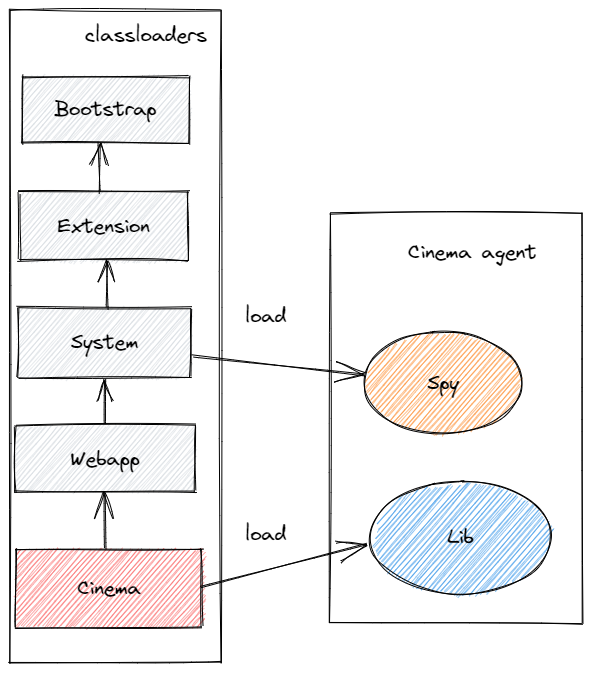
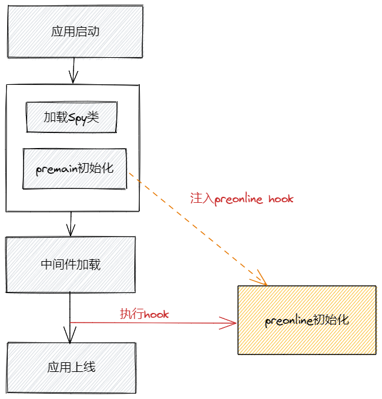

# 全链路压测-录制回放agent
## 背景
在全链路压测中，流量录制和回放的必要性不用多说，而去哪儿网主要技术栈为java，因此在内部开发了一个基于java字节码插桩的录制回放agent—cinema。  
Cinema agent已经在内部使用近一年，在实际的全链路压测中经受住了考验。

## 技术选型
在调研阶段，笔者就意识到，单纯的网络流量录制回放无法满足实际的压测需求，对java代码的修改必不可少，首先就排除了只做网络流量的录制回放方案。
当时业内开源的有一定知名度的java录制回放工具为阿里巴巴的基于jvm-sandbox实现的jvm-sandbox-repeater，公司内部的自动化测试系统也使用到了这个agent，在一开始也对jvm-sandbox-repeater进行了调研。  
调研下来，jvm-sandbox-repeater能做到java方法级的录制回放，在功能上基本符合要求，但有如下几个缺点。
* 逻辑流四五分裂，导致开发和维护体验非常糟糕。排除框架性代码，只谈具体录制回放的部分，整个录制回放逻辑流被拆的到处都是，处理代码非常反直觉，看代码的过程让人苦不堪言。
* Classloader没有做合适处理，录制回放代码中充斥大量反射调用，同样严重影响了开发维护体验。
* 难以和去哪儿中间件结合。去哪儿的全链路压测基于内部的全链路追踪系统qtrace，并且需要在很多地方使用到内部的配置中心qconfig对整个流程进行控制，这需要对jvm-sandbox和jvm-sandbox-repeater都进行较为深度的修改，并且由于前面两个缺点修改的难度和工作量就更大了。  

基于以上的原因，加上自主开发也能够更好的自主可控，选择了重头开发一个录制回放agent。

## 设计与实现
本文主要说明的是录制回放agent的设计与实现。

### 字节码插桩
字节码插桩相关的东西网上有大量的文章和文档，这里不再进行具体的技术说明。  
在插桩实现上，cinema agent主要采用了bytebuddy做为字节码插桩工具，在少量因为jvm限制（不能动态增减类的字段和方法）无法使用bytebuddy的地方使用了asm进行插桩。
### 录制回放代码编写
有句名言说的好，代码是给人看的，顺便才让机器执行。  
Jvm-sandbox-repeater中录制回放的逻辑流非常分散，导致了最终的代码晦涩难懂，但实际上录制回放的逻辑本身是非常简单的，cinema agent对此做了针对性的改进，可以以非常自然符合直觉的方式编写相关代码。  
在cinema录制回放的编写中，排除掉错误处理部分，简化后的核心代码如下：  
```java
if (needRecord()) {
    Object result = originCall.call(arguments);
    storeRecord(arguments, result);
    return result;
} else if (needRepeat()) {
    return repeatStore.Call(arguments);
} else {
    return originCall.call(arguments);
}
```
其中originCall.call(arguments)就是对原始方法的调用，整个处理流程非常清晰，即使是新人，也可以参考已有代码对新组件进行快速兼容。  
同时，得益于精心设计的初始化流程和classloader处理，在录制回放代码编写中，不需要使用反射，在agent的开发中可以和开发业务代码一样直接使用要进行插桩的组件的类和方法，也可以直接调用去哪儿内部的中间件（有人会说平常写代码不都是这样的吗，没错，平常写代码就是这样，就像空气一样，失去时你才会更理解它的重要性）。  
这里也提一下，cinema本身是一个透明的无侵入agent，但如果内部工具实现方有意愿，也可以直接在代码中使用cinema的接口参考agent里代码进行实现。

### 初始化与classloader
在前面说过，cinema的录制回放中可以直接使用待插桩组件和内部中间件的类，以一种自然的方式编写代码，同时还能提供api给外部组件来实现录制回放逻辑，这些都是由特殊的初始化流程与classloader决定的。两者相辅相成，所以放到一起来进行说明。  
整个classloader体系如下图所示，cinema agent有两个jar包，一个是spy，一个lib，其中spy部分由SystemClassloader加载，lib部分则由CinemaClassloader加载。



#### Spy
##### Cinema接口
先说spy，spy分为两部分，一部分是cinema的接口，由于接口由SystemClassloader加载，所以这些接口除了可以被lib里的实现使用，也可以在业务代码或者说工具提供方使用。同时由于实现被全部委托到lib包，即使使用了cinema的api，agent的升级对应用和工具方也完全透明。

##### Premain初始化
Spy的另一部分是cinema在premain阶段的初始化代码，注意这只是premain阶段的初始化，并不是cinema全部的初始化。叫premian初始化是因为这里的初始化由java agent的premain方法开始执行。  
在premain初始化里，cinema会对多个类和组件进行字节码修改，这里只说最核心premain插桩与preonline hook注入。  

整个初始化流程如下图所示：



###### Premain插桩
一是确定性的组件比如java servlet，各种httpclient以及dubbo，虽然具体的插桩实现由lib部分实现，但实际上的插桩在初始化就完成了。插桩后的代码大致如下：  
```java
if (needUseCinema()) {
    lazyIntercepter.intercpt(object, method, arguments, originCall);
} else {
    originCall.call(arguments);
}
```

其中lazyIntercepter就是具体插桩实现的包装，此时应用的业务classloader（一般而言就是tomcat的WebappClassloader）还没有加载，lib部分还无法进行初始化，使用懒加载的方式来对代码进行插桩。  
那么为什么要设计这么一个有点绕的插桩机制，是因为通常来说我们只有在premain阶段才能对java类进行字段和方法的增删，只有这样才能够实现前面“录制回放代码编写”所说的简洁清晰的编写机制。  
而needUseCinema()方法则会进执行判断逻辑，只有当cinema agent已经完全初始化（不止是premain初始化），并且当前类的classloader符合要求才会执行。  
这里简单说下当前类的classloader的具体要求，就是要属于业务classloader或者说业务classloader的祖先classloader，这是为了过滤掉额外的java agent中的类（去哪儿的应用往往带有多个agent，而agent的classloader加载的类都是不需要进行录制回放的）。

###### Preonline hook
在premain初始化里另一个核心的字节码修改就是preonline hook的注入。  
这里的preonline指的是在应用启动后，中间件已经加载完成，但应用还没有对外暴露提供服务的阶段。  
Preonline hook注入就是指对在preonline阶段运行的某个方法进行插桩（不同的公司应该具有不同的插桩点，这里不进行具体类和方法名的描述），将hook加入到这个方法的运行代码中。  
具体的hook实现就是一个前文提过的lazyIntercepter对初始化代码的包装，它的任务就是做preonline初始化，只有当premain初始化和preonline初始化都完成的时候，cinema agent才算是完全初始化。

#### Lib
Lib包同样包含两个部分，一部分是各种字节码修改的相关具体实现，这个不多说，一部分就是preonline阶段的初始化代码，也就是preonline初始化的实现。  
为什么在premain初始化外再执行一个preonline初始化呢，有三个目的。  
* 一是要获取业务classloader，而执行preonline代码的classloader就是准确的业务classloader，同时也是cinema classloader的父classloader，是cinema各种操作的基础，相当于agent在业务jvm中的锚点。
* 二是在此时我们才能够确定各种内部中间件已经初始化完毕，从而可以获取去哪儿配置中心上的各种相关配置，组装agent内部各种实现。前文所说的cinema在SystemClassloader的各种接口的实现也都是在此刻被组装，进而将整个cinema agent初始化，设置全局初始化完成标记。
* 三是根据从配置中心获取的配置对应用的java方法进行字节码修改。录制回放的应用往往跑在线上，是不能够对全量的java类进行插桩的，这里需要根据远程配置进行选择性java方法插桩。

### 灵活的配置
Cinema agent被设计为一个基于远程配置的非常灵活的agent。大到一整条链路的录制回放开关，小到某个方法调用录制参数的序列化方式，几乎所有设置都可以通过远程配置动态修改。  
具体有哪些配置属性这里不进行详细说明，只是说一下cinema中的配置层次设计。    
在cinema中，配置分为公共、任务、应用、调用四个级别。
* 公共配置指全局配置，对所有地方生效。
* 任务配置代表某一次全链路压测，不同的压测任务有不同标记，只对指定的任务相关生效。
* 应用配置代表一个指定的业务应用在指定的压测任务下的配置。
* 调用配置就是在指定的任务和应用下的某一个具体调用的配置，比如一次http或者java方法调用。  

其中下级属性默认使用并可以覆盖上级属性，通过公司的配置中心对配置进行动态修改，可以达到对整个全链路压测各个粒度上的精确控制。

### Jvm trace
因为自动化子调用挡板设置（见其它文章）的需要，cinema agent基于去哪儿内部的全链路追踪系统qtrace实现了jvm trace。顾名思义，与全链路追踪不同，jvm trace就是在jvm内部的trace，trace链路不跨jvm，每一个java方法调用作为一个span。  
因为涉及到另外一个内部系统qtrace，这里不再进行详细说明。
## 结尾
Coder lives matter！  
当然这是夸张的说法，写代码和看代码最多只会让人头疼。但代码的可维护性确实也非常重要，也许贴近底层后有时候会变得不太容易，但我们还是可以在这方面努力做点工作。  
需要注意的是，文章里确实介绍了一套可行的可维护性比较好的java agent实现方式，但在具体实现中对classloader的使用要非常小心，对java classloader体系有深刻的理解，agent本身的依赖和打包也要仔细安排，否则非常容易陷入classloader错误的噩梦。  
最后，本文介绍了去哪儿内部自研的基于java字节码插桩，可以通过配置灵活控制，对开发和维护友好的cinema agent，并对设计和实现的一些关键点做了相关说明。