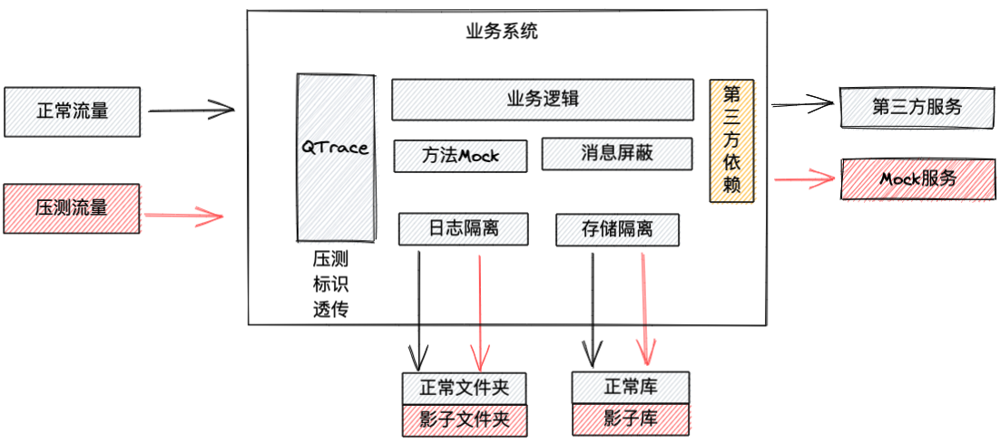
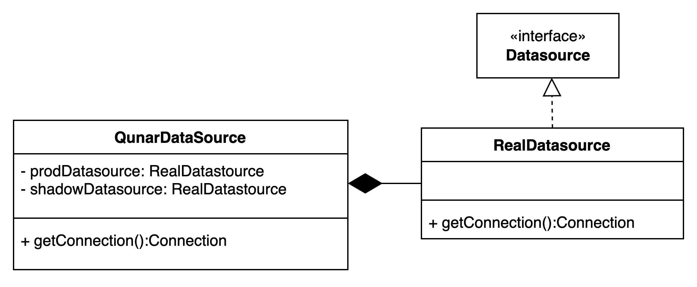
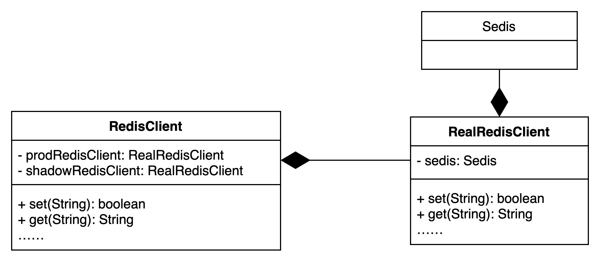
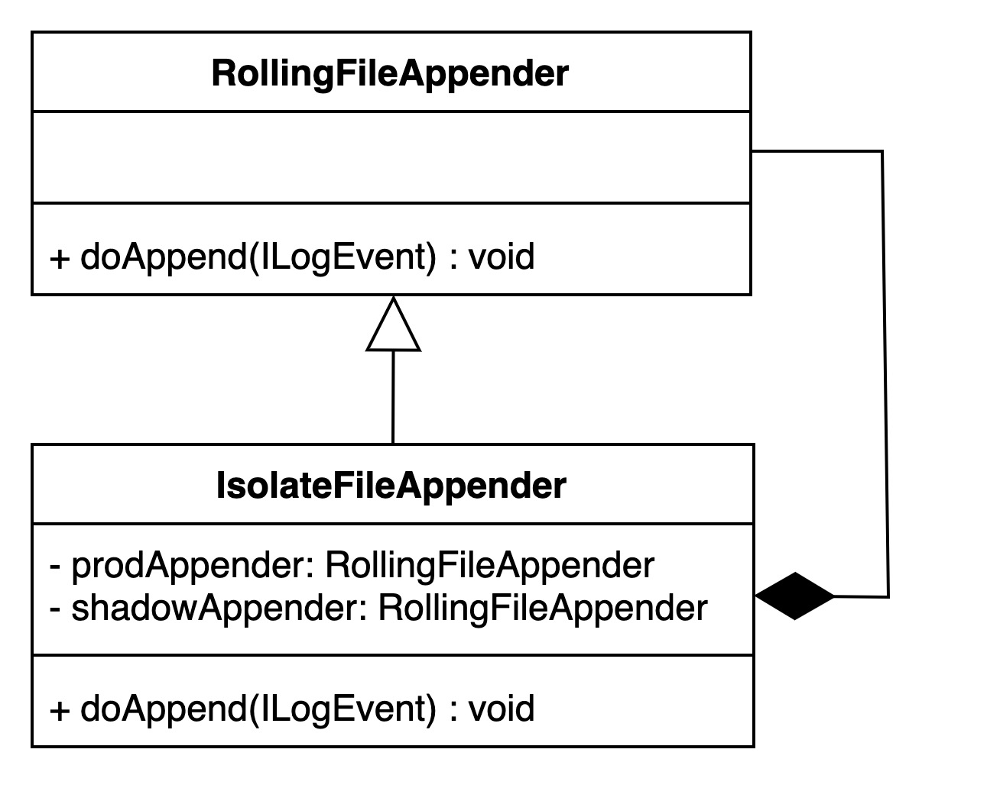

[TOC]
## 中间件实现

### 1 压测标识透传
在生产环境进行全链路压测，需要对压测流量进行染色，使用一个标识来标记流量是正常流量，还是压测流量，且这个标识需要在整个调用链路中透传。标识需要满足以下条件
- 压测的标识在调用过程中不丢失
- 压测的标识在调用过程中不改变

基于去哪儿网内部的分布式链路追踪系统（QTrace），可以达到以上两个要求，压测标识在整个调用链路中透传，在需要的地方进行获取。

>QTrace 是去哪儿网内部的分布式跟踪系统，可以记录分布式场景下调用链路，类似于zipkin。目前该组件支持dubbo调用，http调用，内部的mq系统。

>可以将压测标识放置在Qtrace中，在整个调用链路中传递。

### 2 数据隔离
在生产环境进行全链路压测，最核心的是线上写操作不能影响正常的线上数据。因此需要将压测的数据进行隔离。隔离方案可以分为数据隔离和流量隔离。

#### 2.1 数据隔离 VS 流量隔离
**流量隔离：** 主要是通过构建压测环境来解决，如线下压测环境，或泳道化/Set化建设，将压测流量与线上流程完全隔离。线上流量和压测流量走不同的集群实例。

**数据隔离：** 主要是通过对压测流量进行染色，让线上服务能识别哪些是压测流量，哪些是正常流量，然后对压测流量进行特殊处理，以达到数据隔离。线上流量和压测流量走同样的应用实例，但是在数据存储上做了特殊处理。

公司最后选择做数据隔离，压测流量覆盖的覆盖路径与生产流量相同，能够达到更好的测试效果。

#### 2.2 mysql隔离
mysql的数据隔离方案选择使用影子库进行数据隔离，数据操作时根据压测标识操作不同的数据库。

##### 2.2.1 影子库生命周期
start：当执行测试计划时，创建一个新的影子库的链接池。
end：执行计划结束时，关闭链接池，释放资源。

##### 2.2.2 实现
去哪儿网内部的mysql均使用了中间件团队封装的DataSource，为了实现根据压测标识进行数据隔离，我们将隔离逻辑放在了数据源实现上，具体实现如下：
- 原有的数据源类（QunarDataSource）对外暴露的方法不变，将具体的实现转移到新增类: RealDataSource。
- 原有的数据源类(QunarDataSource）作为代理类，在其中维护两个RealDataSource的实例：一个是生产库的实例 （prodDatasource），另一个是影子库实例（shadowDatasource）。
- 在调用getConnection方法时，判断当前请求是否为压测请求，如果是的话，使用shadowDatasource实例调用；否则使用prodDatasource调用。

#### 2.3 redis隔离
redis的数据隔离方案选择使用影子库进行数据隔离，数据操作时根据压测标识操作不同的数据库。

##### 2.3.1 影子库生命周期
start：当执行测试计划时，创建一个新的影子库的链接池。
end：执行计划结束时，关闭链接池，释放资源。

##### 2.3.2 实现
去哪儿网内部的redis均使用中间件团队封装的RedisClient，可以在其中根据压测表示选择不同的redis实现
- 原有的RedisClient类对外暴露的方法不变，将具体的实现转移到一个新的类：RealRedisClient，
- 原有的RedisClient改造为一个代理类，在里面两个RealRedisClient的实例对象：一个是生产库的实例（prodRedisClient），另一个是影子库的实例（shadowRedisClient）。
- 执行操作redis的方法时，判断当前请求是否为压测请求，如果是的话，使用shadowRedisClient实例调用；否则使用prodRedisClient调用。

#### 2.4 MQ隔离

##### 2.4.1 目标
mq的隔离目标是要保证压测的流量（打了压测标识的消息）只有指定的消费组才能消费。

##### 2.4.2 实现
去哪儿网使用MQ系统为内部开发的[MQ](https://github.com/qunarcorp/qmq)，所以隔离功能可以自由修改，我们把实现逻辑放在server侧：

- 监听配置中心的配置变更，获得压测主题指定的消费组。
- 根据消息中的qtrace链路信息获得压测标识
- 若是压测消息，根据配置判断哪些消费组可以消费。

#### 2.5 日志隔离

##### 2.5.1 目标
日志隔离的目标是保证正常流量的日志与压测流量的日志分开（写到不同的日志文件目录）。防止压测流量日志被日志收集组件收集，影响数据组依据日志的统计报表数据。
效果：在log目录（去哪儿网的部署环境中有个专门存放业务日志的路径）下新建一个tc_shadow目录，压测流量产生的日志放在此处。

##### 2.5.2 实现
- 创建IsolateFileAppender，继承自RollingFileAppender。IsolateFileAppender中保存两个RollingFileAppender 实例，分别是shadowAppender（影子实例，影子实例的文件对应着tc_shadow目录）和prodAppender（生产实例，原有文件目录），覆盖实现RollingFileAppender中的方法。
- 在执行doAppend(ILogEvent)方法时，判断当前日志是否为压测流量，如果是压测流量则使用 shadowInstance执行，否则用prodInstance执行。

IsolateFileAppender在Java应用启动时，由javaAent替换原有日志框架中的FileAppender为IsolateFileAppender，用户不用修改logback.xml

### 录制回放

* [全链路压测-录制回放agent](./cinema.md)