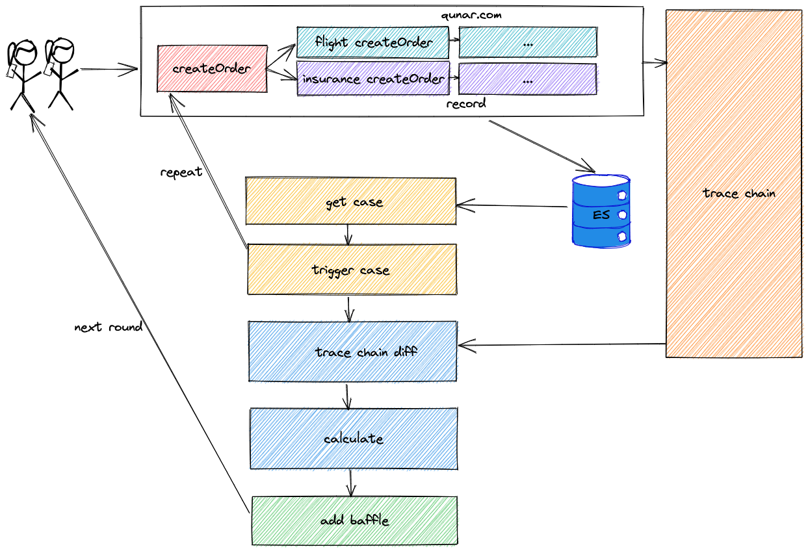
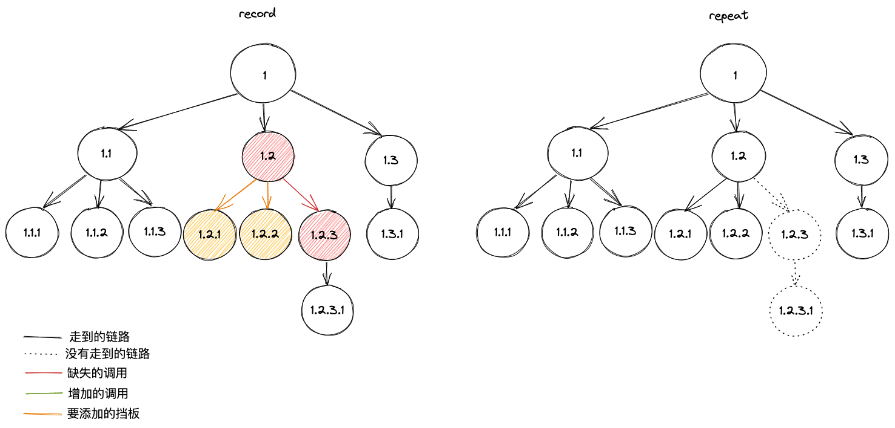
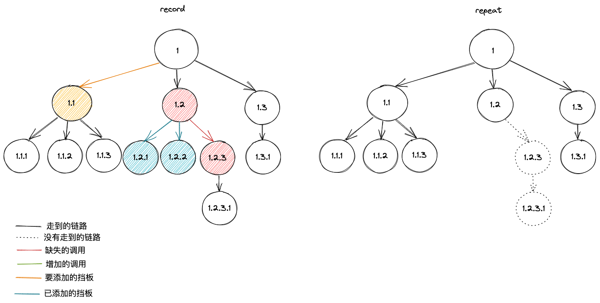
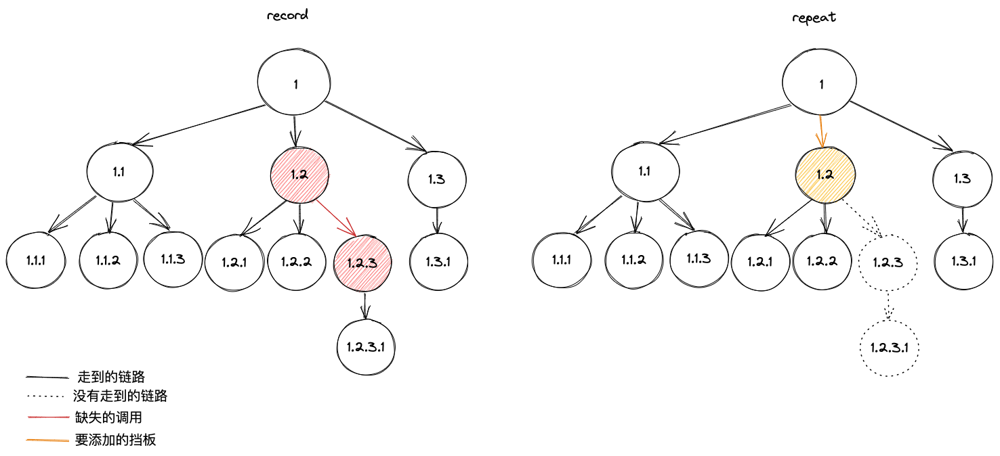

# 全链路写压测-自动设置挡板
## 背景
在全链路写压测中，需要流量的录制和回放、影子库或影子表这些基本技术要素。这些技术在Qunar的实现在其他章节详细介绍。有了基本技术能力后，全链路写压测最麻烦、繁琐的地方莫过于设置需要录制和回放的挡板了。对外部有实际写影响的调用是一定要提前设置挡板的，比如在Qunar比较常见的就是调用支付操作、调用代理商接口实际生成订单、给用户发确认短信等等。还有一些不可重复调用的接口、在内存中有状态维护的系统等也需要配置录制回放。这些要录制、回放的挡板是需要在全链路写压测执行之前配置好的，我们调研过有些公司的方案是：需要业务同学提前梳理对外依赖，给出需要配置的挡板信息。这种方式缺点显而易见，人工梳理耗时久、容易梳理不全。Qunar一个链路可能涉及几百个应用，很难通过人工把这些挡板梳理出来，我们想要探索一种自动化的挡板设置方案，节省梳理配置时间，也避免了遗漏，保证可靠性。

## 技术选型
了解到目前还没有公司实践过自动设置挡板相关的技术，所以我们是完全自研。

## 技术难点
1. **如何自动识别哪里需要设置挡板**
   - 所有对外网的调用
   - 写压测不可穿透的系统（支付、代理商生单、给用户发短信）
   - 导致录制流程和回放流程有差异的子调用（内网http、rpc调用）
   - 导致录制流程和回放流程有差异的内部调用（java方法级别）
2. **如何发现录制流程和回放流程中导致差异的子调用**
   - 识别内网http、rpc调用链路差异
   - 识别内部调用（一个系统内java方法调用链路）差异
3. **相同子调用多次回放怎么选择**
   - 按录制时的调用顺序回放
   - 按参数匹配回放
4. **稳定性问题**
   - 不同的case有不同的链路，可能会导致不同的结果
5. **效率问题**
   - 链路太长，设计几百个系统，怎么能提升效率
   
下面会介绍，每个技术难点的解决方案。

## 设计与实现
### 主流程介绍
整体流程（精简版）：

以机票生单流程为例：

1.开启录制后，真实用户下单时，整个流程走过的系统间的设置了挡板的调用都会被录制下来，录制数据存储到ES中。同时trace系统把整个调用链路也记录了下来；

2.全链路压测系统从ES中获取到符合条件的录制的case后，使用同样的参数向一台机器发起回放请求；

3.服务中的cinema agent识别到是回放请求，如果识别到是配置了挡板的下游调用，会进行回放，不会真实把请求打下去，如果是对db的写操作，会写到影子库中，如果是对db的读操作，会优先读影子库，影子库没有会读线上库；

4.回放过程中，trace系统也会记录调用链路，回放请求完成后可以得到整个回放的trace链路，将录制时的trace链路和回放时的trace链路做diff，可以得到两个链路的差异；

5.通过分析diff结果，通过一个calculate算法，可以得到要设置哪些挡板。后面会详细介绍calculate算法；

6.将计算出的挡板信息真正设置成挡板后，再进行下一轮的录制->获取case->回放->diff->calculate->addBaffle流程；

7.直到最终的录制和回放链路没有差异，且返回值也没有差异时，自动配置挡板流程结束。

### 链路Diff和算法介绍
链路diff和计算挡板算法是密不可分的。调用链路可以保证是一个树状结构，不会有环。首先入口会分配一个traceId,初始spanId是1,然后每一次系统内部对外调用会增加1，每一次跨系统调用spanId会增加一级。链路图如下：

由于同一个链路上的traceId一定是相同的，就省略了traceId，只用spanId来表示每个调用，图中展示的是回放缺失部分链路的情况，1.2->1.2.3是缺失的，设置挡板的时候如果我们把1->1.2设置成挡板，那么录制和回放链路肯定是没有差异的，但是这样的话1.2及其下游系统全链路压测就全都覆盖不到了，为了更精确的找到导致差异的子调用，我们首先分析，可能导致1.2->1.2.3是缺失的，是1.2->1.2.2的返回结果不正确或1.2->1.2.1的返回结果不正确，甚至是1->1.1的返回结果不正确，或者是1.2系统内部流程发生了变化导致的。

**情况1：**

我们认为是1.2->1.2.2的返回结果不正确或1.2->1.2.1的返回结果不正确可能性更大一些，优先把它们设成挡板，看下一次录制和回放的链路diff时是否能正常走到1.2->1.2.3,如果能走到并且入口返回结果正确，说明把它们设成挡板是有效果的。因为设置了两个挡板，为了更精确地找到是哪一个子调用，我们可以依次去掉一个挡板看看效果，首先去掉1.2->1.2.1挡板，如果链路和入口返回结果仍然相同，那说明1.2->1.2.1不是影响回放结果的子调用，1.2->1.2.2是影响回放结果的子调用，一个有效挡板设置完成。

**情况2：**

如果把1.2->1.2.2和1.2->1.2.1都设成挡板后，回放链路仍然缺失1.2->1.2.3，则设置1->1.1为挡板。如果链路和入口返回结果相同，表明设置1->1.1为挡板有效，但1.1还有下游调用，可能是下游调用影响了1.1的返回结果，因此要继续延1.1向下寻找。删除1->1.1挡板，设置1.1->1.1.1、1.1->1.1.2、1.1->1.1.3为挡板，后续流程和之前类似，不再赘述。如果链路和入口返回结果不同，表明设置1->1.1为挡板无效，可能是1.2内部调用的问题，进行情况3。

**情况3：**

当trace链路中差异边前面没有可mock的子调用时，只能是节点1.2系统内部java方法的调用有差异了。我们将进行系统内java方法间调用链路的对比。开启录制java链路开关后，重启一台机器，打到这台机器上的录制请求会上报调用的java方法及jSpanId（类似于系统间的spanId），通过这些jSpanId数据可以构造出一颗树。

在计算要设置的java挡板时，考虑到复杂度，和效率问题，精确性可以不要求那么高，当发现1.2->1.2.3缺失后，直接将1->1.2设成挡板，会更快。当然，如果想讲求精确度，是可以延续使用trace链路的算法，精确计算的。

### 实践过程中遇到的问题及解决方法
**1. 如何快速将不可穿透的外部调用提前统一设成挡板？**

方案1：通过T值获取链路，识别出外网域名和ip，将之一个一个设为公共挡板，这种方式的缺点是如果链路变化，不能及时识别到，有遗漏的风险；

方案2：在中间级别改造，在中间件内部识别外网域名和ip，定义一个统一的配置，只需配置一次。

**2.相同子调用出现多次，回放时如何选择**

最初我们只是提供了方案1，后面发现有入口时一次请求，到下游是并发生单的场景，如果按录制顺序回放会导致回放的结果和请求参数对应不上，导致后面生单流程异常。于是我们又支持了方案2，由于方案2有一定的性能损耗，默认使用方案1，特殊子调用支持配置成方案2。

方案1：按录制时调用顺序（index）回放，简单高效，并发的子调用不适合；

方案2：支持配置特殊子调用按参数自动模糊匹配，可以配置最多对比层数，默认对比前2层，比如最外层有10个字段，第二层有5个字段，最终会从录制的子调用中选择出和回放的参数能够匹配上最多的来返回。

**3.线上的一个入口请求会由于参数的不同而走不通的流程，可能会导致链路差异较大，从而影响自动设置挡板算法的准确性**

对录制case进行筛选，比如只筛选返回值中带"生单成功"关键字的case，保证不会因为多次捞取的case不同而影响后续运算。

**4.一个链路涉及几百个应用，每个应用又提供多个接口，假设精确找到一个有效挡板需要15min，假设每个系统要设1个挡板，那么设挡板过程可能需要几天时间，如何能提升自动配置的效率**

如果完全按顺序地自顶向下计算设置挡板，整个大链路可能要1个月的时间才能调试完成。我们想到的方案是，将整个大链路拆成若干个小链路，小链路之间可以并行调试，最终再整合到一起。